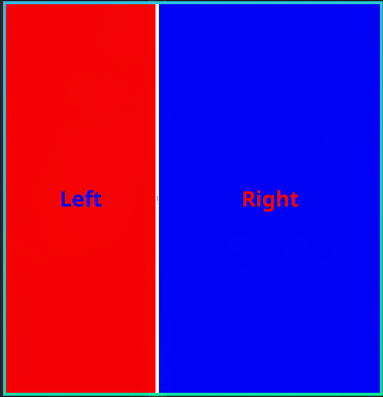
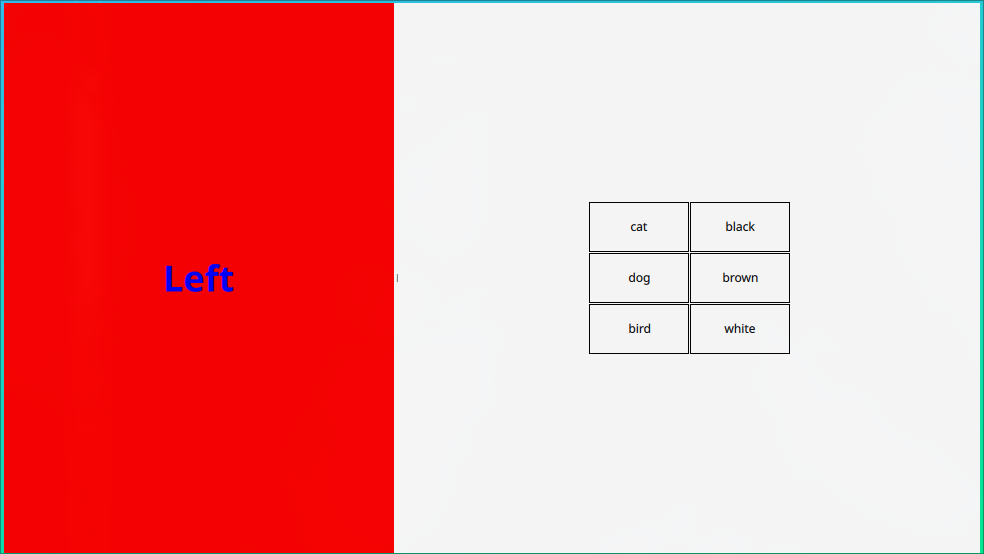
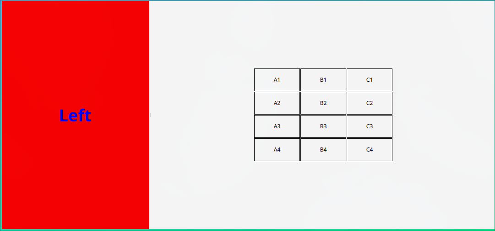
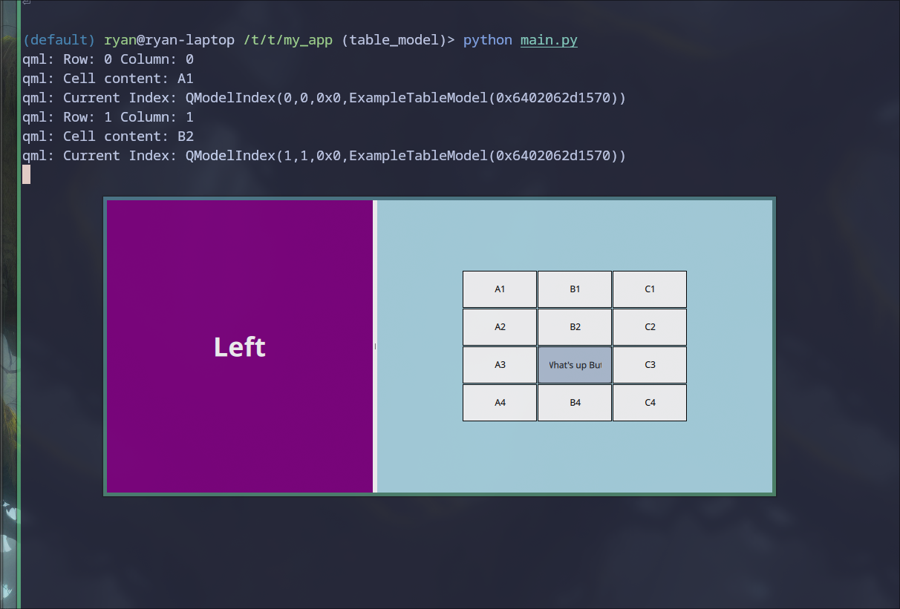
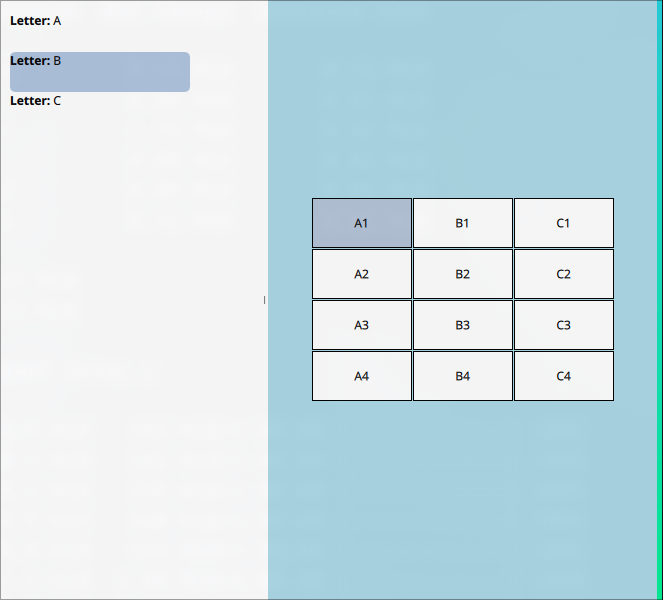

# Table View

## Simple Layout
Start with a simple layout:



```qml
pragma ComponentBehavior: Bound
import QtQuick
import QtQuick.Window
import QtQuick.Controls
import QtQuick.Controls.Material

ApplicationWindow {
    id: root
    property int focusBorderWidth: 10
    width: 640
    height: 480
    visible: true
    title: "Animated Rectangle Demo"

    SplitView {
        orientation: Qt.Horizontal
        anchors.fill: parent

        Rectangle {
            id: rect_1
            SplitView.preferredWidth: 0.4 * parent.width
            color: "red"
            Label {
                text: "Left"
                color: "blue"
                anchors.centerIn: parent
                font.pixelSize: 36
                font.bold: true
            }
        }

        Rectangle {
            id: rect_2
            SplitView.preferredWidth: 0.6 * parent.width
            color: "blue"
            Label {
                text: "Right"
                color: "red"
                anchors.centerIn: parent
                font.pixelSize: 36
                font.bold: true
            }
        }
    }
}
```


## Pure QML Table

Start with the simple table model from [^1740376766], note there is a mistake in the documentation, the delegate requires the line:

[^1740376766]: [TableView QML Type | Qt Quick 6.8.2](https://doc.qt.io/qt-6/qml-qtquick-tableview.html)


```qml
    required property string display
```

and the text should be qualified with an id like this:

```qml
text: myItem.display
```

I had trouble getting this to work otherwise. So the delegate should look like this


```qml
delegate: Rectangle {
    id: myItem
    implicitWidth: 100
    implicitHeight: 50
    border.width: 1
    required property string display

    // If editing is enabled
    required property bool editing

    Text {
        text: myItem.display
        anchors.centerIn: parent

        // Must have these four for text wrapping
        anchors.fill: parent
        horizontalAlignment: Text.AlignHCenter
        verticalAlignment: Text.AlignVCenter
        wrapMode: Text.Wrap

        // Must have this for editing, requires property above
        visible: !myItem.editing
    }
}
```

and the entire QML should look like this:




```qml
import QtQuick
import QtQuick.Window
import QtQuick.Controls
import QtQuick.Controls.Material
import Qt.labs.qmlmodels  // This is REQUIRED for TableModel

ApplicationWindow {
    id: root
    property int focusBorderWidth: 10
    width: 640
    height: 480
    visible: true
    title: "Animated Rectangle Demo"

    component MyTableModel: TableModel {
            TableModelColumn {
                display: "name"
            }
            TableModelColumn {
                display: "color"
            }

            rows: [
                {
                    "name": "cat",
                    "color": "black"
                },
                {
                    "name": "dog",
                    "color": "brown"
                },
                {
                    "name": "bird",
                    "color": "white"
                }
            ]
        }

    component MyTable: TableView {
        columnSpacing: 1
        rowSpacing: 1
        clip: true
        anchors.centerIn: parent
        width: Math.min(parent.width, contentWidth)
        height: Math.min(parent.height, contentHeight)

        model: MyTableModel {}

        delegate: Rectangle {
            id: myItem
            implicitWidth: 100
            implicitHeight: 50
            border.width: 1
            required property string display

            Text {
                text: myItem.display

                // Must have these four for text wrapping
                anchors.fill: parent
                horizontalAlignment: Text.AlignHCenter
                verticalAlignment: Text.AlignVCenter
                wrapMode: Text.Wrap

                // Consider clipping or eliding if not wrapping
                clip: true
                // elide: Text.ElideMiddle
            }
        }

        Rectangle {
            focus: false
            anchors.fill: parent
            border.width: parent.activeFocus ? 10 : 0
            border.color: Material.accent
        }
    }

    component FocusableRectangle: Rectangle {
        border.width: activeFocus ? 10 : 0
        border.color: Material.accent
        focus: true
        activeFocusOnTab: true
    }

    SplitView {
        orientation: Qt.Horizontal
        anchors.fill: parent

        FocusableRectangle {
            id: rect_1
            SplitView.preferredWidth: 0.4 * parent.width
            color: "red"
            Label {
                text: "Left"
                color: "blue"
                anchors.centerIn: parent
                font.pixelSize: 36
                font.bold: true
            }
        }

        FocusableRectangle {
            id: rect_2
            SplitView.preferredWidth: 0.4 * parent.width
            color: "lightblue"
            MyTable {}
        }
    }
}


```

## Adding Keybindings

In order to benefit from keybindings, one must create an `ItemSelectionModel`, with this the user can move through the cells of a table when it is active and press enter to print the value of the current cell:


```qml
    component MyTable: TableView {
        id: tableView
        columnSpacing: 1
        rowSpacing: 1
        // clip: true
        anchors.centerIn: parent
        width: Math.min(parent.width, contentWidth)
        height: Math.min(parent.height, contentHeight)
        activeFocusOnTab: true

        model: MyTableModel {}

        // Create a Selection Model
        selectionModel: ItemSelectionModel {
            model: tableView.model
        }

        // Allow the user to interact with an index
        Keys.onPressed: function (event) {
            if (event.key === Qt.Key_Return || event.key === Qt.Key_Space) {
                // Get the cell content
                let row = tableView.currentRow;
                let column = tableView.currentColumn;
                let cellContent = tableView.model.rows[row][Object.keys(tableView.model.rows[row])[column]];
                console.log("Cell content:", cellContent);

                // Get the current index
                let currentIndex = tableView.model.index(tableView.currentRow, tableView.currentColumn);
                console.log("Current Index:", currentIndex);

                selectionModel.select(currentIndex, ItemSelectionModel.Toggle);
                // This is required, otherwise Tab just moves between cells and the user
                // cannot move between widgets after getting trapped in the table
            } else if (event.key === Qt.Key_Tab) {
                if (event.modifiers & Qt.ShiftModifier) {
                    // Shift+Tab: move focus to previous item
                    tableView.nextItemInFocusChain(false).forceActiveFocus();
                } else {
                    // Tab: move focus to next item
                    tableView.nextItemInFocusChain(true).forceActiveFocus();
                }
                event.accepted = true;
            }
        }

        delegate: Rectangle {
            id: myItem
            implicitWidth: 100
            implicitHeight: 50
            border.width: 1
            // Required Properties for selectable Cells
            required property string display
            required property bool selected
            required property bool current

            // Color the current cell
            color: selected ? Material.accent : (current ? Material.highlightedRippleColor : "white")

            Text {
                text: myItem.display

                // Must have these four for text wrapping
                anchors.fill: parent
                horizontalAlignment: Text.AlignHCenter
                verticalAlignment: Text.AlignVCenter
                wrapMode: Text.Wrap

                // Change the colour of the text when selected
                color: myItem.selected ? "white" : "black"

                // Consider clipping or eliding if not wrapping
                clip: true
                // elide: Text.ElideMiddle
            }
        }
    }
```

## Handling Focus

The Table can't fill a split view like a [ListView](./list.md) can, instead we set the border to be coloured when the child is active:

```qml
SplitView {
        orientation: Qt.Horizontal
        anchors.fill: parent

        FocusableRectangle {
            id: rect_1
            SplitView.preferredWidth: 0.4 * parent.width
            color: "purple"
            Label {
                text: "Left"
                color: "white"
                anchors.centerIn: parent
                font.pixelSize: 36
                font.bold: true
            }
        }

        Rectangle {
            id: rect_2
            SplitView.preferredWidth: 0.4 * parent.width
            focus: false
            color: "lightblue"
            border.width: theTableView.activeFocus ? 10 : 0
            border.color: Material.accent
            MyTable {
                id: theTableView
            }
        }
    }
```

## All Together


```qml
import QtQuick
import QtQuick.Window
import QtQuick.Controls
import QtQuick.Controls.Material
import Qt.labs.qmlmodels

ApplicationWindow {
    id: root
    property int focusBorderWidth: 10
    width: 640
    height: 480
    visible: true
    title: "Animated Rectangle Demo"

    component MyTableModel: TableModel {
        TableModelColumn {
            display: "name"
        }
        TableModelColumn {
            display: "color"
        }

        rows: [
            {
                "name": "cat",
                "color": "black"
            },
            {
                "name": "dog",
                "color": "brown"
            },
            {
                "name": "bird",
                "color": "white"
            }
        ]
    }

    component MyTable: TableView {
        id: tableView
        columnSpacing: 1
        rowSpacing: 1
        // clip: true
        anchors.centerIn: parent
        width: Math.min(parent.width, contentWidth)
        height: Math.min(parent.height, contentHeight)
        activeFocusOnTab: true

        model: MyTableModel {}

        // Create a Selection Model
        selectionModel: ItemSelectionModel {
            model: tableView.model
        }

        // Allow the user to interact with an index
        Keys.onPressed: function (event) {
            if (event.key === Qt.Key_Return || event.key === Qt.Key_Space) {
                // Get the cell content
                let row = tableView.currentRow;
                let column = tableView.currentColumn;
                let cellContent = tableView.model.rows[row][Object.keys(tableView.model.rows[row])[column]];
                console.log("Cell content:", cellContent);

                // Get the current index
                let currentIndex = tableView.model.index(tableView.currentRow, tableView.currentColumn);
                console.log("Current Index:", currentIndex);

                selectionModel.select(currentIndex, ItemSelectionModel.Toggle);
                // This is required, otherwise Tab just moves between cells and the user
                // cannot move between widgets after getting trapped in the table
            } else if (event.key === Qt.Key_Tab) {
                if (event.modifiers & Qt.ShiftModifier) {
                    // Shift+Tab: move focus to previous item
                    tableView.nextItemInFocusChain(false).forceActiveFocus();
                } else {
                    // Tab: move focus to next item
                    tableView.nextItemInFocusChain(true).forceActiveFocus();
                }
                event.accepted = true;
            }
        }

        delegate: Rectangle {
            id: myItem
            implicitWidth: 100
            implicitHeight: 50
            border.width: 1
            // Required Properties for selectable Cells
            required property string display
            required property bool selected
            required property bool current

            // Color the current cell
            color: selected ? Material.accent : (current ? Material.highlightedRippleColor : "white")

            Text {
                text: myItem.display

                // Must have these four for text wrapping
                anchors.fill: parent
                horizontalAlignment: Text.AlignHCenter
                verticalAlignment: Text.AlignVCenter
                wrapMode: Text.Wrap

                // Change the colour of the text when selected
                color: myItem.selected ? "white" : "black"

                // Consider clipping or eliding if not wrapping
                clip: true
                // elide: Text.ElideMiddle
            }
        }
    }

    component FocusableRectangle: Rectangle {
        border.width: activeFocus ? 10 : 0
        border.color: Material.accent
        focus: true
        activeFocusOnTab: true
    }

    SplitView {
        orientation: Qt.Horizontal
        anchors.fill: parent

        FocusableRectangle {
            id: rect_1
            SplitView.preferredWidth: 0.4 * parent.width
            color: "purple"
            Label {
                text: "Left"
                color: "white"
                anchors.centerIn: parent
                font.pixelSize: 36
                font.bold: true
            }
        }

        Rectangle {
            id: rect_2
            SplitView.preferredWidth: 0.4 * parent.width
            focus: false
            color: "lightblue"
            border.width: theTableView.activeFocus ? 10 : 0
            border.color: Material.accent
            MyTable {
                id: theTableView
            }
        }
    }
}
```


## Basic Table



### Code

#### Python

##### Table Manager

```python
# example_table_model.py

from typing import final, override
from PySide6.QtCore import (
    QAbstractTableModel,
    QModelIndex,
    QPersistentModelIndex,
    Qt,
    QObject,
)


@final
class ExampleTableModel(QAbstractTableModel):
    def __init__(self, parent: QObject | None = None):
        super().__init__(parent)
        # Sample data for the table
        self._data = [
            ["A1", "B1", "C1"],
            ["A2", "B2", "C2"],
            ["A3", "B3", "C3"],
            ["A4", "B4", "C4"],
        ]

    @override
    def rowCount(
        self, parent: QModelIndex | QPersistentModelIndex | None = None
    ) -> int:
        if parent is None:
            parent = QModelIndex()
        if parent.isValid():
            return 0
        return len(self._data)

    @override
    def columnCount(
        self, parent: QModelIndex | QPersistentModelIndex | None = None
    ) -> int:
        if parent is None:
            parent = QModelIndex()
        if parent.isValid():
            return 0
        return len(self._data[0]) if self._data else 0

    @override
    def data(
        self,
        index: QModelIndex | QPersistentModelIndex,
        role: int = Qt.ItemDataRole.DisplayRole,
    ) -> str | None:
        if not index.isValid():
            return None

        if role == Qt.ItemDataRole.DisplayRole:
            row = index.row()
            col = index.column()
            if 0 <= row < len(self._data) and 0 <= col < len(self._data[0]):
                return self._data[row][col]

        return None

    @override
    def headerData(
        self,
        section: int,
        orientation: Qt.Orientation,
        role: int = Qt.ItemDataRole.DisplayRole,
    ) -> str | None:
        if role != Qt.ItemDataRole.DisplayRole:
            return None

        if orientation == Qt.Orientation.Horizontal:
            return f"Column {section + 1}"
        else:
            return f"Row {section + 1}"


```


##### Main.py


```python
import signal
import sys
from pathlib import Path
from PySide6.QtGui import QGuiApplication
from PySide6.QtQml import QQmlApplicationEngine, qmlRegisterType
from example_table_model import ExampleTableModel


def main():
    app = QGuiApplication(sys.argv)
    signal.signal(signal.SIGINT, signal.SIG_DFL)

    qml_import_name = "TableManager"
    qmlRegisterType(ExampleTableModel, qml_import_name, 1, 0, "ExampleTableModel")  # pyright: ignore

    engine = QQmlApplicationEngine()

    qml_file = Path(__file__).parent / "main.qml"
    engine.load(qml_file)

    if not engine.rootObjects():
        sys.exit(-1)

    sys.exit(app.exec())


if __name__ == "__main__":
    main()
```


#### QML


##### Minimum Working Example

```qml
import QtQuick
import QtQuick.Window
import QtQuick.Controls
import QtQuick.Controls.Material
import TableManager

ApplicationWindow {
    id: root
    property int focusBorderWidth: 10
    width: 640
    height: 480
    visible: true
    title: "Animated Rectangle Demo"

    SplitView {
        orientation: Qt.Horizontal
        anchors.fill: parent

        Rectangle {
            id: rect_1
            SplitView.preferredWidth: 0.4 * parent.width
            color: "red"
            Label {
                text: "Left"
                color: "blue"
                anchors.centerIn: parent
                font.pixelSize: 36
                font.bold: true
            }
        }

        Rectangle {
            SplitView.preferredWidth: 0.4 * parent.width
            Item {
                anchors.fill: parent
                TableView {
                    anchors.centerIn: parent
                    width: Math.min(parent.width, contentWidth)
                    height: Math.min(parent.height, contentHeight)
                    columnSpacing: 1
                    rowSpacing: 1
                    clip: true

                    model: ExampleTableModel {}

                    delegate: Rectangle {
                        id: myItem
                        implicitWidth: 100
                        implicitHeight: 50
                        border.width: 1
                        // Required Properties for selectable Cells
                        required property string display
                        required property bool selected
                        required property bool current
                        // Required Properties for Editable Cells
                        required property int row
                        required property int column
                        required property bool editing

                        Text {
                            text: myItem.display

                            // Must have this for editing, requires property above
                            visible: !myItem.editing

                            // Must have these four for text wrapping
                            anchors.fill: parent
                            horizontalAlignment: Text.AlignHCenter
                            verticalAlignment: Text.AlignVCenter
                            wrapMode: Text.Wrap

                            // Change the colour of the text when selected
                            color: myItem.selected ? "white" : "black"

                            // Consider clipping or eliding if not wrapping
                            clip: true
                            // elide: Text.ElideMiddle
            }
                    }
                }
            }
        }
    }
}
```


There's a few things to note here:

- Use `myItem.display`  and avoid unqalified access to `display`
    - The table will appear empty unless the following is included in the delegate rectangle:

    ```qml
    required property string display
    ```

##### Adapting the code from Above

the logic to access cell items changes when the model is defined in Python:

```qml
// Get the cell content using the model's data method
let cellContent = tableView.model.data(tableView.model.index(row, column));
console.log("Cell content:", cellContent);

// Get the current index for selection
let currentIndex = tableView.model.index(tableView.currentRow, tableView.currentColumn);
console.log("Current Index:", currentIndex);
```


```qml
Keys.onPressed: function (event) {
    if (event.key === Qt.Key_Return || event.key === Qt.Key_Space) {
        // Get the current cell information
        let row = tableView.currentRow;
        let column = tableView.currentColumn;
        console.log("Row:", row, "Column:", column)

        // Get the cell content using the model's data method
        let cellContent = tableView.model.data(tableView.model.index(row, column));
        console.log("Cell content:", cellContent);

        // Get the current index for selection
        let currentIndex = tableView.model.index(tableView.currentRow, tableView.currentColumn);
        console.log("Current Index:", currentIndex);

        selectionModel.select(currentIndex, ItemSelectionModel.Toggle);
        // This is required, otherwise Tab just moves between cells and the user
        // cannot move between widgets after getting trapped in the table
    }
}
```


So all together the QML would look like this:


```qml

import QtQuick
import QtQuick.Window
import QtQuick.Controls
import QtQuick.Controls.Material
import TableManager

ApplicationWindow {
    id: root
    property int focusBorderWidth: 10
    width: 640
    height: 480
    visible: true
    title: "Animated Rectangle Demo"

    component MyTable: TableView {
        id: tableView
        columnSpacing: 1
        rowSpacing: 1
        // clip: true
        anchors.centerIn: parent
        width: Math.min(parent.width, contentWidth)
        height: Math.min(parent.height, contentHeight)
        activeFocusOnTab: true

        model: ExampleTableModel {}

        // Create a Selection Model
        selectionModel: ItemSelectionModel {
            model: tableView.model
        }

        // Allow the user to interact with an index
        Keys.onPressed: function (event) {
            if (event.key === Qt.Key_Return || event.key === Qt.Key_Space) {
                // Get the current cell information
                let row = tableView.currentRow;
                let column = tableView.currentColumn;
                console.log("Row:", row, "Column:", column)

                // Get the cell content using the model's data method
                let cellContent = tableView.model.data(tableView.model.index(row, column));
                console.log("Cell content:", cellContent);

                // Get the current index for selection
                let currentIndex = tableView.model.index(tableView.currentRow, tableView.currentColumn);
                console.log("Current Index:", currentIndex);

                selectionModel.select(currentIndex, ItemSelectionModel.Toggle);
                // This is required, otherwise Tab just moves between cells and the user
                // cannot move between widgets after getting trapped in the table
            } else if (event.key === Qt.Key_Tab) {
                if (event.modifiers & Qt.ShiftModifier) {
                    // Shift+Tab: move focus to previous item
                    tableView.nextItemInFocusChain(false).forceActiveFocus();
                } else {
                    // Tab: move focus to next item
                    tableView.nextItemInFocusChain(true).forceActiveFocus();
                }
                event.accepted = true;
            }
        }

        delegate: Rectangle {
            id: myItem
            implicitWidth: 100
            implicitHeight: 50
            border.width: 1
            // Required Properties for selectable Cells
            required property string display
            required property bool selected
            required property bool current
            // Required Properties for Editable Cells
            required property int row
            required property int column
            required property bool editing

            // Color the current cell
            color: selected ? Material.accent : (current ? Material.highlightedRippleColor : "white")

            Text {
                text: myItem.display

                // Must have this for editing, requires property above
                visible: !myItem.editing

                // Must have these four for text wrapping
                anchors.fill: parent
                horizontalAlignment: Text.AlignHCenter
                verticalAlignment: Text.AlignVCenter
                wrapMode: Text.Wrap

                // Change the colour of the text when selected
                color: myItem.selected ? "white" : "black"

                // Consider clipping or eliding if not wrapping
                clip: true
                // elide: Text.ElideMiddle
            }
        }
    }

    component FocusableRectangle: Rectangle {
        border.width: activeFocus ? 10 : 0
        border.color: Material.accent
        focus: true
        activeFocusOnTab: true
    }

    SplitView {
        orientation: Qt.Horizontal
        anchors.fill: parent

        FocusableRectangle {
            id: rect_1
            SplitView.preferredWidth: 0.4 * parent.width
            color: "purple"
            Label {
                text: "Left"
                color: "white"
                anchors.centerIn: parent
                font.pixelSize: 36
                font.bold: true
            }
        }

        Rectangle {
            id: rect_2
            SplitView.preferredWidth: 0.4 * parent.width
            focus: false
            color: "lightblue"
            border.width: theTableView.activeFocus ? 10 : 0
            border.color: Material.accent
            MyTable {
                id: theTableView
            }
        }
    }
}
```


## Editing Data


### Python
Add the following to the python model:


```python

@final
class ExampleTableModel(QAbstractTableModel):

    # ...
    # ... AS Above
    # ...

    @override
    def flags(self, index: QModelIndex) -> Qt.ItemFlags:
        if not index.isValid():
            return Qt.ItemFlag.NoItemFlags
        return Qt.ItemFlag.ItemIsEnabled | Qt.ItemFlag.ItemIsSelectable | Qt.ItemFlag.ItemIsEditable

    @override
    def setData(
        self,
        index: QModelIndex,
        value: str,
        role: int = Qt.ItemDataRole.EditRole,
    ) -> bool:
        if not index.isValid():
            return False

        if role == Qt.ItemDataRole.EditRole:
            row = index.row()
            col = index.column()
            if 0 <= row < len(self._data) and 0 <= col < len(self._data[0]):
                self._data[row][col] = value
                self.dataChanged.emit(index, index, [role])
                print(f"Python could, e.g., update a SQL database or save the data to disk here: ([{row=}, {col=}]: {value=})")
                return True

        return False
```


### QML


It's important to include a property to indicate editing in the delegate (This is not mentioned in the editing example in the online documentation for the tableview [^1740387790], However it is further down  [^1740387872], referring to the QtCreator can take you straight to the right section which can be helpful!)

[^1740387790]: [TableView QML Type | Qt Quick 6.8.2](https://doc.qt.io/qt-6/qml-qtquick-tableview.html#editing-cells)
[^1740387872]: https://doc.qt.io/qt-6/qml-qtquick-tableview.html#editDelegate-attached-prop


```qml

delegate: Rectangle {
    required property bool editing

```

So the delegate will look something like this


```qml
delegate: Rectangle {
    id: myItem
    implicitWidth: 100
    implicitHeight: 50
    border.width: 1
    // Required Properties for selectable Cells
    required property string display
    required property bool selected
    required property bool current
    // Required Properties for Editable Cells
    required property int row
    required property int column
    required property bool editing

    // Color the current cell
    color: selected ? Material.accent : (current ? Material.highlightedRippleColor : "white")

    // Display the Text
    Text {
        text: myItem.display

        // Must have this for editing, requires property above
        visible: !myItem.editing

        // Must have these four for text wrapping
        anchors.fill: parent
        horizontalAlignment: Text.AlignHCenter
        verticalAlignment: Text.AlignVCenter
        wrapMode: Text.Wrap

        // Change the colour of the text when selected
        color: myItem.selected ? "white" : "black"

        // Consider clipping or eliding if not wrapping
        clip: true
        // elide: Text.ElideMiddle
    }
```

Overall the delegate should look like this:



```qml
    component MyTable: TableView {
        id: tableView
        columnSpacing: 1
        rowSpacing: 1
        // clip: true
        anchors.centerIn: parent
        width: Math.min(parent.width, contentWidth)
        height: Math.min(parent.height, contentHeight)
        activeFocusOnTab: true

        model: ExampleTableModel {}

        // Create a Selection Model
        selectionModel: ItemSelectionModel {
            model: tableView.model
        }

        // Allow the user to interact with an index
        Keys.onPressed: function (event) {
            if (event.key === Qt.Key_Return || event.key === Qt.Key_Space) {
                // Get the current cell information
                let row = tableView.currentRow;
                let column = tableView.currentColumn;
                console.log("Row:", row, "Column:", column);

                // Get the cell content using the model's data method
                let cellContent = tableView.model.data(tableView.model.index(row, column));
                console.log("Cell content:", cellContent);

                // Get the current index for selection
                let currentIndex = tableView.model.index(tableView.currentRow, tableView.currentColumn);
                console.log("Current Index:", currentIndex);

                selectionModel.select(currentIndex, ItemSelectionModel.Toggle);
                // This is required, otherwise Tab just moves between cells and the user
                // cannot move between widgets after getting trapped in the table
            } else if (event.key === Qt.Key_Tab) {
                if (event.modifiers & Qt.ShiftModifier) {
                    // Shift+Tab: move focus to previous item
                    tableView.nextItemInFocusChain(false).forceActiveFocus();
                } else {
                    // Tab: move focus to next item
                    tableView.nextItemInFocusChain(true).forceActiveFocus();
                }
                event.accepted = true;
            }
        }

        delegate: Rectangle {
            id: myItem
            implicitWidth: 100
            implicitHeight: 50
            border.width: 1
            // Required Properties for selectable Cells
            required property string display
            required property bool selected
            required property bool current
            // Required Properties for Editable Cells
            required property int row
            required property int column
            required property bool editing

            // Color the current cell
            color: selected ? Material.accent : (current ? Material.highlightedRippleColor : "white")

            // Text in the cell
            Text {
                text: myItem.display

                // Must have this for editing, requires property above
                visible: !myItem.editing

                // Must have these four for text wrapping
                anchors.fill: parent
                horizontalAlignment: Text.AlignHCenter
                verticalAlignment: Text.AlignVCenter
                wrapMode: Text.Wrap

                // Change the colour of the text when selected
                color: myItem.selected ? "white" : "black"

                // Consider clipping or eliding if not wrapping
                clip: true
                // elide: Text.ElideMiddle
            }

            // Logic to Trigger a Cell Edit
            function edit_cell() {
                let index = myItem.TableView.view.model.index(myItem.row, myItem.column);
                myItem.TableView.view.edit(index);
            }

            MouseArea {
                anchors.fill: parent
                onDoubleClicked: myItem.edit_cell()
            }

            Keys.onPressed: function (event) {
                if (event.key === Qt.Key_F2) {
                    edit_cell()
                }
            }

            // Display the editing
            TableView.editDelegate: TextField {
                required property string display
                anchors.fill: parent
                text: display
                horizontalAlignment: TextInput.AlignHCenter
                verticalAlignment: TextInput.AlignVCenter
                Component.onCompleted: selectAll()

                TableView.onCommit: {
                    // 'display = text' is short-hand for:
                    // let index = TableView.view.index(row, column)
                    // TableView.view.model.setData(index, "display", text)
                    let index = myItem.TableView.view.model.index(row, column);
                    myItem.TableView.view.model.setData(index, text, Qt.EditRole);
                }

                Keys.onPressed: function (event) {
                    if (event.key === Qt.Key_Escape) {
                        myItem.TableView.view.closeEditor();
                    }
                }
            }
        }
    }
```


### All the code

#### Python

```python

from typing import final, override
from PySide6.QtCore import (
    QAbstractTableModel,
    QModelIndex,
    QPersistentModelIndex,
    Qt,
    QObject,
)


@final
class ExampleTableModel(QAbstractTableModel):
    def __init__(self, parent: QObject | None = None):
        super().__init__(parent)
        # Sample data for the table
        self._data = [
            ["A1", "B1", "C1"],
            ["A2", "B2", "C2"],
            ["A3", "B3", "C3"],
            ["A4", "B4", "C4"],
        ]

    @override
    def rowCount(
        self, parent: QModelIndex | QPersistentModelIndex | None = None
    ) -> int:
        if parent is None:
            parent = QModelIndex()
        if parent.isValid():
            return 0
        return len(self._data)

    @override
    def columnCount(
        self, parent: QModelIndex | QPersistentModelIndex | None = None
    ) -> int:
        if parent is None:
            parent = QModelIndex()
        if parent.isValid():
            return 0
        return len(self._data[0]) if self._data else 0

    @override
    def data(
        self,
        index: QModelIndex | QPersistentModelIndex,
        role: int = Qt.ItemDataRole.DisplayRole,
    ) -> str | None:
        if not index.isValid():
            return None

        if role == Qt.ItemDataRole.DisplayRole:
            row = index.row()
            col = index.column()
            if 0 <= row < len(self._data) and 0 <= col < len(self._data[0]):
                return self._data[row][col]

        return None

    @override
    def headerData(
        self,
        section: int,
        orientation: Qt.Orientation,
        role: int = Qt.ItemDataRole.DisplayRole,
    ) -> str | None:
        if role != Qt.ItemDataRole.DisplayRole:
            return None

        if orientation == Qt.Orientation.Horizontal:
            return f"Column {section + 1}"
        else:
            return f"Row {section + 1}"

    @override
    def flags(self, index: QModelIndex) -> Qt.ItemFlags:
        if not index.isValid():
            return Qt.ItemFlag.NoItemFlags
        return Qt.ItemFlag.ItemIsEnabled | Qt.ItemFlag.ItemIsSelectable | Qt.ItemFlag.ItemIsEditable

    @override
    def setData(
        self,
        index: QModelIndex,
        value: str,
        role: int = Qt.ItemDataRole.EditRole,
    ) -> bool:
        if not index.isValid():
            return False

        if role == Qt.ItemDataRole.EditRole:
            row = index.row()
            col = index.column()
            if 0 <= row < len(self._data) and 0 <= col < len(self._data[0]):
                # Ensure value is converted to string
                self._data[row][col] = str(value)
                # Emit for both Edit and Display roles since they share the same data
                self.dataChanged.emit(index, index, [Qt.ItemDataRole.EditRole, Qt.ItemDataRole.DisplayRole])
                return True

        return False
```


#### QML

```qml

import QtQuick
import QtQuick.Window
import QtQuick.Controls
import QtQuick.Controls.Material
import TableManager
import Qt.labs.qmlmodels

ApplicationWindow {
    id: root
    property int focusBorderWidth: 10
    width: 640
    height: 480
    visible: true
    title: "Animated Rectangle Demo"

    component MyTableModel: TableModel {
        TableModelColumn {
            display: "name"
        }
        TableModelColumn {
            display: "color"
        }

        rows: [
            {
                "name": "cat",
                "color": "black"
            },
            {
                "name": "dog",
                "color": "brown"
            },
            {
                "name": "bird",
                "color": "white"
            }
        ]
    }

    component MyTable: TableView {
        id: tableView
        columnSpacing: 1
        rowSpacing: 1
        // clip: true
        anchors.centerIn: parent
        width: Math.min(parent.width, contentWidth)
        height: Math.min(parent.height, contentHeight)
        activeFocusOnTab: true

        model: ExampleTableModel {}

        // Create a Selection Model
        selectionModel: ItemSelectionModel {
            model: tableView.model
        }

        // Allow the user to interact with an index
        Keys.onPressed: function (event) {
            if (event.key === Qt.Key_Return || event.key === Qt.Key_Space) {
                // Get the current cell information
                let row = tableView.currentRow;
                let column = tableView.currentColumn;
                console.log("Row:", row, "Column:", column);

                // Get the cell content using the model's data method
                let cellContent = tableView.model.data(tableView.model.index(row, column));
                console.log("Cell content:", cellContent);

                // Get the current index for selection
                let currentIndex = tableView.model.index(tableView.currentRow, tableView.currentColumn);
                console.log("Current Index:", currentIndex);

                selectionModel.select(currentIndex, ItemSelectionModel.Toggle);
                // This is required, otherwise Tab just moves between cells and the user
                // cannot move between widgets after getting trapped in the table
            } else if (event.key === Qt.Key_Tab) {
                if (event.modifiers & Qt.ShiftModifier) {
                    // Shift+Tab: move focus to previous item
                    tableView.nextItemInFocusChain(false).forceActiveFocus();
                } else {
                    // Tab: move focus to next item
                    tableView.nextItemInFocusChain(true).forceActiveFocus();
                }
                event.accepted = true;
            }
        }

        delegate: Rectangle {
            id: myItem
            implicitWidth: 100
            implicitHeight: 50
            border.width: 1
            // Required Properties for selectable Cells
            required property string display
            required property bool selected
            required property bool current
            // Required Properties for Editable Cells
            required property int row
            required property int column
            required property bool editing

            // Color the current cell
            color: selected ? Material.accent : (current ? Material.highlightedRippleColor : "white")

            // Text in the cell
            Text {
                text: myItem.display

                // Must have this for editing, requires property above
                visible: !myItem.editing

                // Must have these four for text wrapping
                anchors.fill: parent
                horizontalAlignment: Text.AlignHCenter
                verticalAlignment: Text.AlignVCenter
                wrapMode: Text.Wrap

                // Change the colour of the text when selected
                color: myItem.selected ? "white" : "black"

                // Consider clipping or eliding if not wrapping
                clip: true
                // elide: Text.ElideMiddle
            }

            // Logic to Trigger a Cell Edit
            function edit_cell() {
                let index = myItem.TableView.view.model.index(myItem.row, myItem.column);
                myItem.TableView.view.edit(index);
            }

            MouseArea {
                anchors.fill: parent
                onDoubleClicked: myItem.edit_cell()
            }

            Keys.onPressed: function (event) {
                if (event.key === Qt.Key_F2) {
                    edit_cell()
                }
            }

            // Display the editing
            TableView.editDelegate: TextField {
                required property string display
                anchors.fill: parent
                text: display
                horizontalAlignment: TextInput.AlignHCenter
                verticalAlignment: TextInput.AlignVCenter
                Component.onCompleted: selectAll()

                TableView.onCommit: {
                    // 'display = text' is short-hand for:
                    // let index = TableView.view.index(row, column)
                    // TableView.view.model.setData(index, "display", text)
                    let index = myItem.TableView.view.model.index(row, column);
                    myItem.TableView.view.model.setData(index, text, Qt.EditRole);
                }

                Keys.onPressed: function (event) {
                    if (event.key === Qt.Key_Escape) {
                        myItem.TableView.view.closeEditor();
                    }
                }
            }
        }
    }

    component FocusableRectangle: Rectangle {
        border.width: activeFocus ? 10 : 0
        border.color: Material.accent
        focus: true
        activeFocusOnTab: true
    }

    SplitView {
        orientation: Qt.Horizontal
        anchors.fill: parent

        FocusableRectangle {
            id: rect_1
            SplitView.preferredWidth: 0.4 * parent.width
            color: "purple"
            Label {
                text: "Left"
                color: "white"
                anchors.centerIn: parent
                font.pixelSize: 36
                font.bold: true
            }
        }

        Rectangle {
            id: rect_2
            SplitView.preferredWidth: 0.4 * parent.width
            focus: false
            color: "lightblue"
            border.width: theTableView.activeFocus ? 10 : 0
            border.color: Material.accent
            MyTable {
                id: theTableView
            }
        }
    }
}

```


### Going Further

#### Animations

One of the big advantages of qml is animations for free. Right click the table and it will spin around which is neat:


```qml
component AnimatedTableView: TableView {
        id: tableView
        // Transform properties for animations
        transform: [
            Rotation {
                id: tableRotation
                origin.x: tableView.width / 2
                origin.y: tableView.height / 2
                axis {
                    x: 0
                    y: 1
                    z: 0
                }
            },
            Translate {
                id: tableTranslate
                y: 0
            }
        ]

        // Animations
        ParallelAnimation {
            id: tableAnimation
            SequentialAnimation {
                NumberAnimation {
                    target: tableTranslate
                    property: "y"
                    to: -50
                    duration: 300
                    easing.type: Easing.OutQuad
                }
                NumberAnimation {
                    target: tableTranslate
                    property: "y"
                    to: 0
                    duration: 300
                    easing.type: Easing.InQuad
                }
            }
            NumberAnimation {
                target: tableRotation
                property: "angle"
                from: 0
                to: 360
                duration: 600
                easing.type: Easing.InOutQuad
            }
        }

        // Mouse area for right-click detection
        MouseArea {
            anchors.fill: parent
            acceptedButtons: Qt.RightButton
            onClicked: function (mouse) {
                if (mouse.button === Qt.RightButton) {
                    tableAnimation.start();
                }
            }
        }
    }
```

Then just change the `TableView` for `AnimatedTableView`


```diff
1c1
< component MyTable: TableView {
---
> component MyTable: AnimatedTableView {
```


## Dynamic Table
### Introduction
Let's now create a list on the left that changes the type of the table displayed on the right side.

For now, let's just set a prefix value.

### Create a List



First create a  listView as shown in [List](./list.md):


- Model
    ```qml
    component TablePrefixModel: ListModel {
        ListElement {
            name: "Letter A"
            prefix: "A"
        }
        ListElement {
            name: "Letter B"
            prefix: "B"
        }
        ListElement {
            name: "Letter C"
            prefix: "C"
        }
    }
    ```
- Delegate

    Note here that the mouseArea onClicked simply changes the current item, the change in current item will later be used to emit a signal

    ```qml
        component ListDelegate: Item {
            id: myItem
            required property string prefix
            required property int index
            width: 180
            height: 40

            Rectangle {
                anchors.fill: parent
                color: mouseArea.containsMouse ? Qt.lighter("lightsteelblue", 1.1) : "transparent"

                Column {
                    Text {
                        text: '<b>Letter: </b> ' + myItem.prefix
                    }
                }

                MouseArea {
                    id: mouseArea
                    anchors.fill: parent
                    hoverEnabled: true
                    onClicked: myItem.ListView.view.currentIndex = myItem.index
                }
            }
        }
    ```
- View
    ```qml
    component TablePrefixListView: ListView {
        id: myList
        width: 180
        height: 200
        activeFocusOnTab: true
        highlight: Rectangle {
            color: "lightsteelblue"
            radius: 5
        }
        highlightFollowsCurrentItem: true
        highlightMoveDuration: 500
        keyNavigationWraps: true

        model: TablePrefixModel {}
        focus: true
        delegate: ListDelegate {}
    }
    ```


### Add the list to the main View


```qml
SplitView {
        id: mainSplit
        orientation: Qt.Horizontal
        anchors.fill: parent
        property int focusBorderWidth: 10

        Rectangle {
            focus: false
            border.width: leftList.activeFocus ? mainSplit.focusBorderWidth : 0
            border.color: Material.accent
            SplitView.preferredWidth: 0.4 * parent.width
            TablePrefixListView {
                id: leftList
                anchors.fill: parent
                topMargin: mainSplit.focusBorderWidth + 2
                leftMargin: mainSplit.focusBorderWidth + 2
            }
        }

        Rectangle {
            id: rect_2
            SplitView.preferredWidth: 0.4 * parent.width
            focus: false
            color: "lightblue"
            border.width: theTableView.activeFocus ? 10 : 0
            border.color: Material.accent
            MyTable {
                id: theTableView
            }
        }
}
```


### Emit a signal when List item changes

Emit a signal when the current index changes:

```qml
component TablePrefixListView: ListView {
        id: myList
        width: 180
        height: 200
        activeFocusOnTab: true
        highlight: Rectangle {
            color: "lightsteelblue"
            radius: 5
        }
        highlightFollowsCurrentItem: true
        highlightMoveDuration: 500
        keyNavigationWraps: true

        signal itemSelected(string prefix)

        model: TablePrefixModel {}
        focus: true
        delegate: ListDelegate {}

        onCurrentIndexChanged: {
            if (currentIndex >= 0 && currentItem) {
                // The following works too
                // currentItem.prefix
                let prefix = model.get(currentIndex).prefix;
                console.log("Printing prefix: " + prefix);
                // Emit the signal
                itemSelected(prefix);
            }
        }
    }
```


Next connect that signal using:

```qml
Connections {
        target: leftList
        function onitemSelected(prefix) {
            console.log("Signal Connected to slot:", prefix);
        }
    }
```


So all the main content should look like this:


```qml
SplitView {
        id: mainSplit
        orientation: Qt.Horizontal
        anchors.fill: parent
        property int focusBorderWidth: 10

        Rectangle {
            focus: false
            border.width: leftList.activeFocus ? mainSplit.focusBorderWidth : 0
            border.color: Material.accent
            SplitView.preferredWidth: 0.4 * parent.width
            TablePrefixListView {
                id: leftList
                anchors.fill: parent
                topMargin: mainSplit.focusBorderWidth + 2
                leftMargin: mainSplit.focusBorderWidth + 2
            }
        }
        Connections {
            target: leftList
            function onitemSelected(prefix) {
                console.log("Signal Connected to slot:", prefix);
            }
        }

        Rectangle {
            id: rect_2
            SplitView.preferredWidth: 0.4 * parent.width
            focus: false
            color: "lightblue"
            border.width: theTableView.activeFocus ? 10 : 0
            border.color: Material.accent
            MyTable {
                id: theTableView
            }
        }
    }
```


### Allow the Table Model to be Dynamic


```qml
Connections {
    target: leftList
    function onitemSelected(prefix) {
        console.log("Signal Connected to slot:", prefix);
        theTableView.model.setPrefix(prefix);
    }
}
```


Now that slot simply needs to be exposed in Python:


```python
class ExampleTableModel(QAbstractTableModel):
    def __init__(self, parent: QObject | None = None):
        super().__init__(parent)
        self._prefix = "A"  # Default prefix
        self._all_data = {
            "A": [
                ["A1 the quick brown fox jumped over the lazy dogs", "B1", "C1"],
                ["A2", "B2", "C2"],
                ["A3", "B3", "C3"],
                ["A4", "B4", "C4"],
            ],
            "B": [
                ["B1 jumped over", "B1", "C1"],
                ["B2", "B2", "C2"],
                ["B3", "B3", "C3"],
            ],
            "C": [
                ["C1 the lazy", "B1", "C1"],
                ["C2", "B2", "C2"],
                ["C3", "B3", "C3"],
                ["C4", "B4", "C4"],
                ["C5", "B5", "C5"],
            ]
        }
        self._data = self._all_data[self._prefix]

    @Slot(str)
    def setPrefix(self, prefix: str) -> None:
        """Update the table data based on the selected prefix"""
        if prefix in self._all_data and prefix != self._prefix:
            self.beginResetModel()
            self._prefix = prefix
            self._data = self._all_data[prefix]
            self.endResetModel()

```


Now when the user moves between items in the list the table will change.


### Extending this Example

One could also display Seaborn Dataframes like so:


- Python
    ```python
    @final
    class ExampleTableModel(QAbstractTableModel):
        def __init__(self, parent: QObject | None = None):
            super().__init__(parent)
            self._prefix = "iris"  # Default prefix
            self._data = sns.load_dataset(self._prefix).to_numpy().tolist()
            self.datasets = [
                "anagrams",
                "anscombe",
                "attention",
                "brain_networks",
                "car_crashes",
                "diamonds",
                "dots",
                "dowjones",
                "exercise",
                "flights",
                "fmri",
                "geyser",
                "glue",
                "healthexp",
                "iris",
                "mpg",
                "penguins",
                "planets",
                "seaice",
                "taxis",
                "tips",
                "titanic",
            ]

        @Slot(str)
        def setPrefix(self, prefix: str) -> None:
            """Update the table data based on the selected prefix"""
            if prefix in self.datasets and prefix != self._prefix:
                self.beginResetModel()
                self._prefix = prefix
                print("I am: ", prefix)
                self._data = sns.load_dataset(prefix).to_numpy().tolist()
                self.endResetModel()
    ```

- QML
    ```qml
    component TablePrefixModel: ListModel {
            ListElement {
                name: "Iris"
                prefix: "iris"
            }
            ListElement {
                name: "Diamonds"
                prefix: "diamonds"
            }
            ListElement {
                name: "Titanic"
                prefix: "titanic"
            }
        }
    ```

    Also Consider adding scrollbars:


    ```qml
    component MyTable: AnimatedTableView {
        id: tableView
        columnSpacing: 1
        rowSpacing: 1
        // clip: true

        // Add Scrollbars
        anchors.centerIn: parent
        width: Math.min(parent.width, contentWidth)
        height: parent.height
        activeFocusOnTab: true
        ScrollBar.vertical: ScrollBar {}
        ScrollBar.horizontal: ScrollBar {}

        model: ExampleTableModel {}
    ```


### TODO Saving file on Edit (call Slot)


### TODO Including a Table Header

Headers on table are also a bit of an afterthought in QML. The [TableView QML Type | Qt Quick 6.8.2](https://doc.qt.io/qt-6/qml-qtquick-tableview.html) docs provide that [HorizontalHeaderView QML Type | Qt Quick Controls 6.8.2](https://doc.qt.io/qt-6/qml-qtquick-controls-horizontalheaderview.html) can be used.

first create a header delegate:


```qml
component HeaderDelegate: Rectangle {
        id: headerItem
        implicitWidth: 100
        implicitHeight: 30
        color: "#e0e0e0"
        border.width: 1
        border.color: "#c0c0c0"

        // Required property for header delegate
        required property string display

        Text {
            text: headerItem.display
            anchors.fill: parent
            horizontalAlignment: Text.AlignHCenter
            verticalAlignment: Text.AlignVCenter
            elide: Text.ElideRight
            font.bold: true
        }
    }
```


then connect that to the pre-existing table like so:

```qml
Rectangle {
        id: rect_2
        SplitView.preferredWidth: 0.4 * parent.width
        focus: false
        color: "lightblue"
        border.width: theTableView.activeFocus ? 10 : 0
        border.color: Material.accent

        Item {
            id: tableContainer
            anchors.fill: parent
            anchors.margins: 10

            Item {
                id: tableWrapper
                anchors.centerIn: parent
                width: Math.min(parent.width, theTableView.contentWidth + 2) // +2 for border
                height: horizontalHeader.height + theTableView.contentHeight + 1 // +1 for the gap

                HorizontalHeaderView {
                    id: horizontalHeader
                    syncView: theTableView
                    anchors.top: parent.top
                    anchors.left: parent.left
                    anchors.right: parent.right
                    height: 30
                    delegate: HeaderDelegate {}
                }

                MyTable {
                    id: theTableView
                    anchors.top: horizontalHeader.bottom
                    anchors.left: parent.left
                    anchors.right: parent.right
                    anchors.bottom: parent.bottom
                    anchors.topMargin: 1 // Small gap between header and table
                    width: parent.width
                    height: parent.height - horizontalHeader.height - 1
                }
            }
        }
    }

```


The header data is provided by the model from python like so:


```python
@final
class ExampleTableModel(QAbstractTableModel):
    # ...
    # ...
    # ...

    @override
    def headerData(
        self,
        section: int,
        orientation: Qt.Orientation,
        role: int = Qt.ItemDataRole.DisplayRole,
    ) -> str | None:
        if role != Qt.ItemDataRole.DisplayRole:
            return None

        if orientation == Qt.Orientation.Horizontal:
            return f"Column {section + 1}"
        else:
            return f"Row {section + 1}"
```


## Project

SQLite Browser? Maybe Trees first actually
