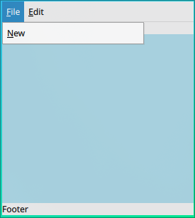
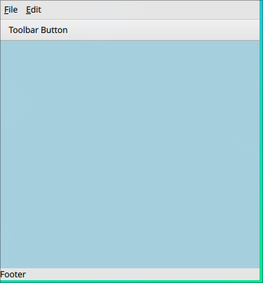
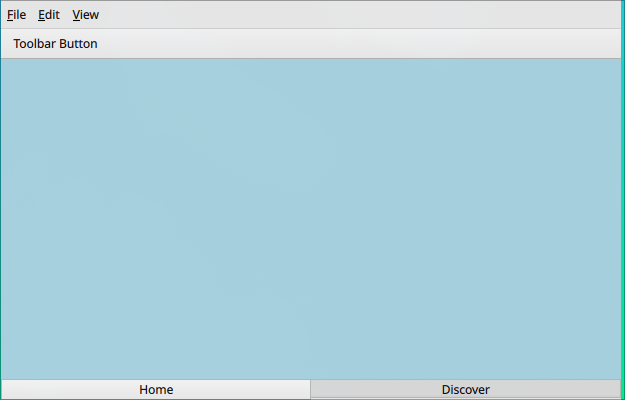
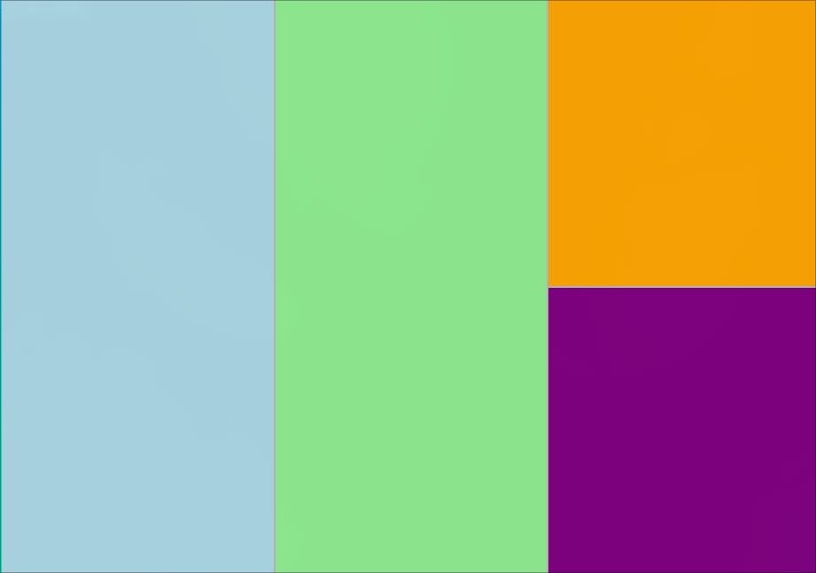

# Creating a Menu Bar

The `ApplicationWindow` item supports a Menu bar, Header and Footer:

```qml
import QtQuick
import QtQuick.Window
import QtQuick.Controls
import QtQuick.Controls.Fusion
import QtQuick.Layouts

ApplicationWindow {
    id: root
    width: 640
    height: 480
    visible: true
    title: "Animated Rectangle Demo"

    menuBar: Label {text: "Menu"}
    header: Label {text: "Header"}
    footer: Label {text: "Footer"}

    Rectangle {
        color: "lightblue"
        anchors.fill: parent
    }

}
```

Run this with:

```
qml6 /path/to/main.qml
```


Some things to discuss later:

- Label
    - This lets us add text
- Rectangle vs Item
    - Like a Div in HTML, let's us encapsulate text, Rectangle is an Item with a background color
- anchors
    - This is explained well in the book, for now, anchors.fill: parent means that this item spans the entire parent


We can create menu items:



```qml
import QtQuick
import QtQuick.Window
import QtQuick.Controls
import QtQuick.Controls.Fusion
import QtQuick.Layouts

ApplicationWindow {
    id: root
    width: 640
    height: 480
    visible: true
    title: "Animated Rectangle Demo"

    menuBar: MenuBar {
        id: menuBar
        Menu {
            id: menuFile
            title: qsTr("&File")
            Action {
                text: qsTr("&New")
                shortcut: "Ctrl+N"
                onTriggered: console.log("New File Triggered")
            }
        }
        Menu {
            id: menuEdit
            title: qsTr("&Edit")
            Action {
                text: qsTr("&Undo")
                shortcut: "Ctrl+U"
                onTriggered: console.log("Undo Triggered")
            }
        }

    }

    header: Label {text: "Header"}
    footer: Label {text: "Footer"}

    Rectangle {
        color: "lightblue"
        anchors.fill: parent
    }

}

```

From here we can create a Toolbar:



```qml
import QtQuick
import QtQuick.Window
import QtQuick.Controls
import QtQuick.Controls.Fusion
import QtQuick.Layouts

ApplicationWindow {
    id: root
    width: 640
    height: 480
    visible: true
    title: "Animated Rectangle Demo"

    menuBar: MenuBar {
        id: menuBar
        Menu {
            id: menuFile
            title: qsTr("&File")
            Action {
                text: qsTr("&New")
                shortcut: "Ctrl+N"
                onTriggered: console.log("New File Triggered")
            }
        }
        Menu {
            id: menuEdit
            title: qsTr("&Edit")
            Action {
                text: qsTr("&Undo")
                shortcut: "Ctrl+U"
                onTriggered: console.log("Undo Triggered")
            }
        }

    }

    header: ToolBar {
        id: toolBar
        visible: true
        RowLayout {
            anchors.fill: parent
            ToolButton {
                text: qsTr("Toolbar Button")
                onClicked: console.log("Clicked Toolbar")
            }
        }
    }
    footer: Label {text: "Footer"}

    Rectangle {
        color: "lightblue"
        anchors.fill: parent
    }

}

```

This is where we can start playing with some benefits of QML over widgets.

1. when properties are assigned with `:` we create a contract, e.g.:

    ```qml
    header: ToolBar {
        id: toolBar
        visible: true
        // ...
    }
    ```

    This means if the visible property changes, the header will actually disappear


So we can create an action like this:


```qml
Action {
    text: qsTr("Hide &Toolbar")
    shortcut: "Ctrl+Alt+B"
    onTriggered: toolBar.visible = !toolBar.visible
}
```

which will toggle the toolbar. We could also use the toolbar for tabs, in this next code chunk I show how to use tabs in the footer, although they don't do anything yet, just for show:




```qml
import QtQuick
import QtQuick.Window
import QtQuick.Controls
import QtQuick.Controls.Fusion
import QtQuick.Layouts

ApplicationWindow {
    id: root
    width: 640
    height: 480
    visible: true
    title: "Animated Rectangle Demo"

    menuBar: MenuBar {
        id: menuBar
        Menu {
            id: menuFile
            title: qsTr("&File")
            Action {
                text: qsTr("&New")
                shortcut: "Ctrl+N"
                onTriggered: console.log("New File Triggered")
            }
        }
        Menu {
            id: menuEdit
            title: qsTr("&Edit")
            Action {
                text: qsTr("&Undo")
                shortcut: "Ctrl+U"
                onTriggered: console.log("Undo Triggered")
            }
            Menu {
                id: menuEditExtra
                title: qsTr("&Extra")
                Action {
                    text: qsTr("&Something")
                    shortcut: "Ctrl+E"
                    onTriggered: console.log("Edit > Extra > Something Triggered")
                }
            }
        }

        Menu {
            id: menuView
            title: qsTr("&View")
            Menu {
                id: menuViewToggle
                title: qsTr("&Toggle")
                Action {
                    text: qsTr("Hide &Toolbar")
                    shortcut: "Ctrl+Alt+B"
                    onTriggered: toolBar.visible = !toolBar.visible
                }
            }
        }
    }

    header: ToolBar {
        id: toolBar
        visible: true
        RowLayout {
            anchors.fill: parent
            ToolButton {
                text: qsTr("Toolbar Button")
                onClicked: console.log("Clicked Toolbar")
            }
        }
    }
    footer: TabBar {
        id: statusBar
        TabButton {
            text: qsTr("Home")
        }
        TabButton {
            text: qsTr("Discover")
        }
    }

    Rectangle {
        color: "lightblue"
        anchors.fill: parent
    }

}
```

The next thing to cover is creating modular code.

If you create two files:

1. AppMenuBar.qml
    containing:

    ```qml
    menuBar: MenuBar {
        id: menuBar
        Menu {
            // ...
            // ...

    ```
2. main.qml
    containing as above.

then you can move all items into modular files which we've done below:


split view, I'll omit the me

```qml
import QtQuick
import QtQuick.Window
import QtQuick.Controls
import QtQuick.Controls.Fusion
import QtQuick.Layouts

ApplicationWindow {
    id: root
    width: 640
    height: 480
    visible: true
    title: "Animated Rectangle Demo"

    menuBar: AppMenuBar { }

    header: AppToolBar { }
    footer: AppTabBar { }

    Rectangle {
        color: "lightblue"
        anchors.fill: parent
    }

}
```



```qml
import QtQuick
import QtQuick.Window
import QtQuick.Controls
import QtQuick.Controls.Fusion
import QtQuick.Layouts

ApplicationWindow {
    id: root
    width: 640
    height: 480
    visible: true
    title: "Animated Rectangle Demo"

    // Not important here
    // menuBar: AppMenuBar { }
    // header: AppToolBar { }
    // footer: AppTabBar { }

    SplitView {
        anchors.fill: parent
        orientation: Qt.Horizontal
            Rectangle {
                SplitView.preferredWidth: parent.width / 3
                color: "lightblue"
            }
            Rectangle {
                SplitView.preferredWidth: parent.width / 3
                color: "lightgreen"
            }
            Rectangle {
                SplitView.preferredWidth: parent.width / 3
                SplitView {
                    anchors.fill: parent
                    orientation: Qt.Vertical
                    Rectangle {
                        SplitView.preferredHeight: parent.height / 2
                        color: "orange"
                    }
                    Rectangle {
                        SplitView.preferredHeight: parent.height / 2
                        color: "purple"
                    }
                }
            }
        }

}
```

Typically in Qt Widgets we can focus items, this needs to be enabled in QML, this is because QML is more general than  QtWidgets so it can be used to write for touch centric or small screen high dpi displays like the steam deck or even android.

To Enable tabbing between:

```qml
import QtQuick
import QtQuick.Window
import QtQuick.Controls
import QtQuick.Controls.Material
import QtQuick.Layouts

ApplicationWindow {
    id: root
    // Custom handle component for SplitView
    width: 640
    height: 480
    visible: true
    title: "Basidc Desktop Application Example"

    // Not important here
    // menuBar: AppMenuBar { }
    // header: AppToolBar { }
    // footer: AppTabBar { }

    SplitView {
        anchors.fill: parent
        orientation: Qt.Horizontal
        Rectangle {
            SplitView.preferredWidth: parent.width / 3
            color: "lightblue"
            border.width: activeFocus ? 2 : 0
            border.color: Material.accent
            focus: true
            activeFocusOnTab: true  // Add this line
        }
        Rectangle {
            SplitView.preferredWidth: parent.width / 3
            color: "lightgreen"
            border.width: activeFocus ? 2 : 0
            border.color: Material.accent
            focus: true
            activeFocusOnTab: true  // Add this line
        }
        Rectangle {
            SplitView.preferredWidth: parent.width / 3
            SplitView {
                anchors.fill: parent
                orientation: Qt.Vertical
                Rectangle {
                    SplitView.preferredHeight: parent.height / 2
                    color: "orange"
                }
                Rectangle {
                    SplitView.preferredHeight: parent.height / 2
                    color: "purple"
                }
            }
        }
    }
}
```


Now we can make an inline component for this:


```qml
import QtQuick
import QtQuick.Window
import QtQuick.Controls
import QtQuick.Controls.Material
import QtQuick.Layouts

ApplicationWindow {
    id: root
    // Custom handle component for SplitView
    width: 640
    height: 480
    visible: true
    title: "Animated Rectangle Demo"

    component FocusableRectangle: Rectangle {
        border.width: activeFocus ? 10 : 0
        border.color: Material.accent
        focus: true
        activeFocusOnTab: true
    }

    // Not important here
    // menuBar: AppMenuBar { }
    // header: AppToolBar { }
    // footer: AppTabBar { }

    SplitView {
        anchors.fill: parent
        orientation: Qt.Horizontal
        FocusableRectangle {
            SplitView.preferredWidth: parent.width / 3
            color: "lightblue"
        }
        FocusableRectangle {
            SplitView.preferredWidth: parent.width / 3
            color: "lightgreen"
        }
        Rectangle {
            SplitView.preferredWidth: parent.width / 3
            SplitView {
                anchors.fill: parent
                orientation: Qt.Vertical
                FocusableRectangle {
                    SplitView.preferredHeight: parent.height / 2
                    color: "orange"
                }
                FocusableRectangle {
                    SplitView.preferredHeight: parent.height / 2
                    color: "purple"
                }
            }
        }
    }
}
```


The handles themselves are described by rectangles, so we can create a customHandle like so:

```qml
    component CustomHandle: Rectangle {
        implicitWidth: 6
        implicitHeight: 6
    }
```

Which can then be used like so:

```qml
    SplitView {
        anchors.fill: parent
        orientation: Qt.Horizontal
        handle: CustomHandle {}
        // ...
    }
```

This can be extended to change colour on focus and animated (this will be discussed later):

```qml
    component CustomHandle: Rectangle {
        implicitWidth: 6
        implicitHeight: 6
        color: SplitHandle.pressed ? Material.accent
             : SplitHandle.hovered ? Qt.lighter(Material.accent, 1.5)
             : Qt.rgba(0,0,0,0.2)
        Behavior on color { ColorAnimation { duration: 150 } }
    }
```

Here's an example


```qml
import QtQuick
import QtQuick.Window
import QtQuick.Controls
import QtQuick.Controls.Material
import QtQuick.Layouts

ApplicationWindow {
    id: root
    // Custom handle component for SplitView
    width: 640
    height: 480
    visible: true
    title: "Animated Rectangle Demo"

    component CustomHandle: Rectangle {
        implicitWidth: 6
        implicitHeight: 6
        color: SplitHandle.pressed ? Material.accent
             : SplitHandle.hovered ? Qt.lighter(Material.accent, 1.5)
             : Qt.rgba(0,0,0,0.2)
        Behavior on color { ColorAnimation { duration: 150 } }
    }

    component FocusableRectangle: Rectangle {
        border.width: activeFocus ? 10 : 0
        border.color: Material.accent
        focus: true
        activeFocusOnTab: true
    }

    component SplitViewWithCustomHandle: SplitView {
        anchors.fill: parent
        handle: CustomHandle {}
    }


    // Not important here
    // menuBar: AppMenuBar { }
    // header: AppToolBar { }
    // footer: AppTabBar { }

    SplitViewWithCustomHandle {
        orientation: Qt.Horizontal
        FocusableRectangle {
            SplitView.preferredWidth: parent.width / 3
            color: "lightblue"
        }
        FocusableRectangle {
            SplitView.preferredWidth: parent.width / 3
            color: "lightgreen"
        }
        Rectangle {
            SplitView.preferredWidth: parent.width / 3
            SplitViewWithCustomHandle {
                orientation: Qt.Vertical
                FocusableRectangle {
                    SplitView.preferredHeight: parent.height / 2
                    color: "orange"
                }
                FocusableRectangle {
                    SplitView.preferredHeight: parent.height / 2
                    color: "purple"
                }
            }
        }
    }
}
```

Now obviously we don't want to use the mouse to resize the splits, so we can create keybindings for our rectangles like so:


```qml
component FocusableRectangle: Rectangle {
        border.width: activeFocus ? 10 : 0
        border.color: Material.accent
        focus: true
        activeFocusOnTab: true

        Keys.onPressed: function(event) {
            if (event.modifiers & Qt.ControlModifier) {
                const step = 20
                switch(event.key) {
                    case Qt.Key_Left:
                        console.log("left")
                        SplitView.preferredWidth = Math.max(50, SplitView.preferredWidth - step)
                        event.accepted = true
                        break
                    case Qt.Key_Right:
                        console.log("right")
                        SplitView.preferredWidth = Math.min(parent.width - 50, SplitView.preferredWidth + step)
                        event.accepted = true
                        break
                    case Qt.Key_Up:
                        console.log("up")
                        SplitView.preferredHeight = Math.max(50, SplitView.preferredHeight - step)
                        event.accepted = true
                        break
                    case Qt.Key_Down:
                        console.log("down")
                        SplitView.preferredHeight = Math.min(parent.height - 50, SplitView.preferredHeight + step)
                        event.accepted = true
                        break
                }
            }
        }
}


```


here's an example with a delegate

Next we need to make the handles bigger:


```qml
import QtQuick
import QtQuick.Window
import QtQuick.Controls
import QtQuick.Controls.Fusion
import QtQuick.Layouts

ApplicationWindow {
    id: root
    width: 640
    height: 480
    visible: true
    title: "Animated Rectangle Demo"

    // Not important here
    // menuBar: AppMenuBar { }
    // header: AppToolBar { }
    // footer: AppTabBar { }

    SplitView {
        anchors.fill: parent
        orientation: Qt.Horizontal
            Rectangle {
                SplitView.preferredWidth: parent.width / 3
                color: "lightblue"
                anchors.fill: parent
            }
            Rectangle {
                SplitView.preferredWidth: parent.width / 3
                color: "lightgreen"
                anchors.fill: parent
            }
            Rectangle {
                SplitView.preferredWidth: parent.width / 3
                color: "lightred"
                anchors.fill: parent
            }
        }

    Rectangle {
        color: "lightblue"
        anchors.fill: parent
    }

    // Make a couple arbitrary splits
    SplitView {
        anchors.fill: parent
        orientation: Qt.Horizontal
        Repeater {
            model: 5
            delegate: Rectangle {
                SplitView.preferredWidth: parent.width / 5
                Label {
                    anchors.fill: parent
                    text: "Split: " + index
                }
            }
        }
    }
}
```

Later we will discuss animations, here's how to get a handle that highlights on hover:

```qml
    component CustomHandle: Rectangle {
        implicitWidth: 6
        implicitHeight: 6
        color: SplitHandle.pressed ? Material.accent
             : SplitHandle.hovered ? Qt.lighter(Material.accent, 1.5)
             : Qt.rgba(0,0,0,0.2)
        Behavior on color { ColorAnimation { duration: 150 } }
    }
```

