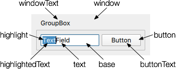

# Dark Mode

## Themes

Dark mode is important, so we'll cover it early.

There are a few themes to choose from:


1. [Universal](https://doc.qt.io/qt-6/qtquickcontrols-universal.html)
    - Microsoft esque

        - **Text**: `text`
        - **Accent**: `accent`
        - **Primary**: `None`

        

2. [Material](https://doc.qt.io/qt-6/qtquickcontrols2-material.html)
    - Google's Material

        - **Text**: `foreground`
        - **Accent**: `accent`
        - **Primary**: `primary`

        

3. [Fusion](https://doc.qt.io/qt-6/qtquickcontrols-fusion.html)
    - Similar to the default widgets

        - **Text**: `text`
        - **Accent**: `None`
        - **Primary**: `None`

    

## Using Themes to set Dark Mode

### Introduction

Material and Universal provide a simple way to toggle dark mode. Fusion will look at the system, however, it's not clear to me what it looks for specifically or how it can be dynamically controlled, see generally [^1740798075]. Whilst, personally, I prefer the Fusion style, Universal and Material look great so I'll use those moving forward. Note that Material can have a somewhat mobile centric design with widgets like buttons, so be mindful when switching between styles.

[^1740798075]: [Styling Qt Quick Controls | Qt Quick Controls 6.8.2](https://doc.qt.io/qt-6/qtquickcontrols-styles.html#universal-style)

### Overview

To toggle Dark mode:

1. use a ternary operator with a property like so:
    ```qml
    ApplicationWindow {
        id: root

        // Set dark mode initially
        property bool darkMode: true

        // Create a contract when that changes
        Universal.theme: root.darkMode ? Universal.Dark : Universal.Light
    ```

2. Create an Action to change that property
    ```qml

    menuBar: MenuBar {
        id: menuBar
        Menu {
            id: menuEdit
            title: qsTr("&View")
            Action {
                text: qsTr("&Dark Mode")
                shortcut: "Ctrl+D"
                onTriggered: root.darkMode = !root.darkMode
            }
        }
    }

    ```

3. Use `color: [Universal | Material].{foreground, background}` throughout to get the correct colours.


### Minimum Working Example


This example demonstrates how to implement dark mode with a minimum working example


```qml
import QtQuick
import QtQuick.Window
import QtQuick.Controls
import QtQuick.Layouts

// Load the theme
import QtQuick.Controls.Universal

ApplicationWindow {
    id: root
    // Custom handle component for SplitView
    width: 640
    height: 480
    visible: true
    title: "Desktop Application Example"

    // Set theme variables
    // Set dark mode initially
    property bool darkMode: true
    // Create a contract when that changes
    Universal.theme: root.darkMode ? Universal.Dark : Universal.Light

    // Set the font size
    property int font_size: 30

    menuBar: MenuBar {
        id: menuBar
        Menu {
            id: contextMenu
            title: "&File"

            Action {
                text: "&Open"
                shortcut: "Ctrl+O"
                onTriggered: console.log("Usage Guide")
            }
        }
        Menu {
            id: menuEdit
            title: qsTr("&View")
            Action {
                text: qsTr("&Dark Mode")
                shortcut: "Ctrl+D"
                onTriggered: root.darkMode = !root.darkMode
            }
        }
    }

    Rectangle {
        anchors.centerIn: parent

        Column {
            Column {
                Slider {
                    id: font_slider
                    from: 10
                    to: 60
                    value: root.font_size
                    stepSize: 1
                    onValueChanged: {
                        root.font_size = value;
                    }
                }
            }

            Label {
                text: root.darkMode ? "Dark Mode" : "Light Mode"
                font.pixelSize: root.font_size
            }
        }
    }
}
```
