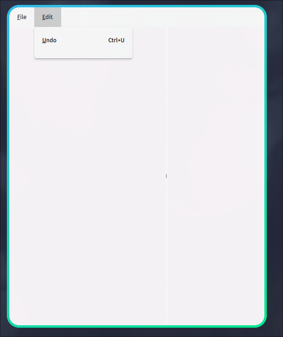

# Menu Bar with Keyboard Shortcut Labels

## Introduction

From QML6, the `MenuItem` no longer supports the `shortcut` field. Whilst it supports an `action` field that allows an associated action, it will not show the corresponding keybinding. As of 2025-03-01 The documentation does not document the `action` field, the documentation in QtCreator continues to list the `shortcut` field which is different from the online documentation and I have been unable to find further information online.

The best approach I can find is a custom delegate [^1740795728], as shown below.

[^1740795728]: [pyside6 - How to add shortcut hint in MenuBar items in Qt/QML 6 - Stack Overflow](https://stackoverflow.com/questions/77163715/how-to-add-shortcut-hint-in-menubar-items-in-qt-qml-6)

## Custom Delegate

A custom delegate can be created for the `Menu` component like so:


```qml
component MenuWithKbd: Menu {
        id: my_menu
        delegate: MenuItem {
            id: control

            contentItem: Item {
                id: my_item
                anchors.centerIn: parent

                function transformString(inputString) {
                    // Find the index of '&' in the input string
                    const ampIndex = inputString.indexOf('&');

                    if (ampIndex !== -1 && ampIndex + 1 < inputString.length) {
                        // Get the character following '&'
                        const charToUnderline = inputString.charAt(ampIndex + 1);

                        // Construct the new string with the character underlined
                        const transformedString = inputString.slice(0, ampIndex) + `<u>${charToUnderline}</u>` + inputString.slice(ampIndex + 2);

                        return transformedString;
                    }

                    // Return the original string if no '&' is present
                    return inputString;
                }

                Text {
                    text: my_item.transformString(control.text)
                    // text: "My <u>S</u>tring"
                    anchors.left: parent.left
                    color: Universal.foreground
                }

                Text {
                    text: control.action.shortcut
                    anchors.right: parent.right
                    color: Universal.foreground
                }
            }
        }
    }

```

## Minimum Working Example

Here is a minimum working example of an application that uses the custom delegate to annotate the keyboard shortcuts. I have only tested this on Linux, so I'm unsure if the keybindings will appear on MacOS with the appropriate symbols (⌘, ⌃, ⌥, ⇧, ⇪, ⏏  [^1740801803] ), although I would presume `control.action.shortcut` would provide the correct symbols.

[^1740801803]: https://apple.stackexchange.com/questions/55727/where-can-i-find-the-unicode-symbols-for-mac-functional-keys-command-shift-e




```qml
import QtQuick
import QtQuick.Window
import QtQuick.Controls
import QtQuick.Controls.Material
import QtQuick.Layouts

ApplicationWindow {
    id: root
    // Custom handle component for SplitView
    width: 640
    height: 480
    visible: true
    title: "Desktop Application Example"

    component MenuWithKbd: Menu {
        id: my_menu
        delegate: MenuItem {
            id: control

            function transformString(inputString) {
                // Find the index of '&' in the input string
                const ampIndex = inputString.indexOf('&');

                if (ampIndex !== -1 && ampIndex + 1 < inputString.length) {
                    // Get the character following '&'
                    const charToUnderline = inputString.charAt(ampIndex + 1);

                    // Construct the new string with the character underlined
                    const transformedString = inputString.slice(0, ampIndex) + `<u>${charToUnderline}</u>` + inputString.slice(ampIndex + 2);

                    return transformedString;
                }

                // Return the original string if no '&' is present
                return inputString;
            }

            contentItem: Item {
                anchors.centerIn: parent

                Text {
                    text: transformString(control.text)
                    // text: "My <u>S</u>tring"
                    anchors.left: parent.left
                    // color: "white"
                }

                Text {
                    function get_shortcut_text() {
                        const s = control.action.shortcut
                        if (typeof s  !== "undefined") {
                            return s
                        } else {
                            return ""
                        }

                    }
                    text: get_shortcut_text()
                    anchors.right: parent.right
                    color: Universal.foreground
                }
            }
        }
    }

    menuBar: MenuBar {
        id: menuBar
        MenuWithKbd {
            id: contextMenu
            title: "&File"

            Action {
                text: "&Open"
                shortcut: "Ctrl+O"
                onTriggered: console.log("Usage Guide")
            }
        }
        MenuWithKbd {
            id: menuEdit
            title: qsTr("&Edit")
            Action {
                text: qsTr("&Undo")
                shortcut: "Ctrl+U"
                onTriggered: console.log("Undo Triggered")
            }
        }
    }

    // footer: AppTabBar { }

    SplitView {
        orientation: Qt.Horizontal
        anchors.fill: parent
        Rectangle {
            SplitView.preferredWidth: parent.width * 0.61
            color: Material.background

            // Allow Focus
            focus: true
            activeFocusOnTab: true
            border.width: activeFocus ? 10 : 0
            border.color: Material.accent
        }
        Rectangle {
            SplitView.preferredWidth: parent.width * 0.61
            color: Material.background

            // Allow Focus
            focus: true
            activeFocusOnTab: true
            border.width: activeFocus ? 10 : 0
            border.color: Material.accent
        }
    }
}
```


