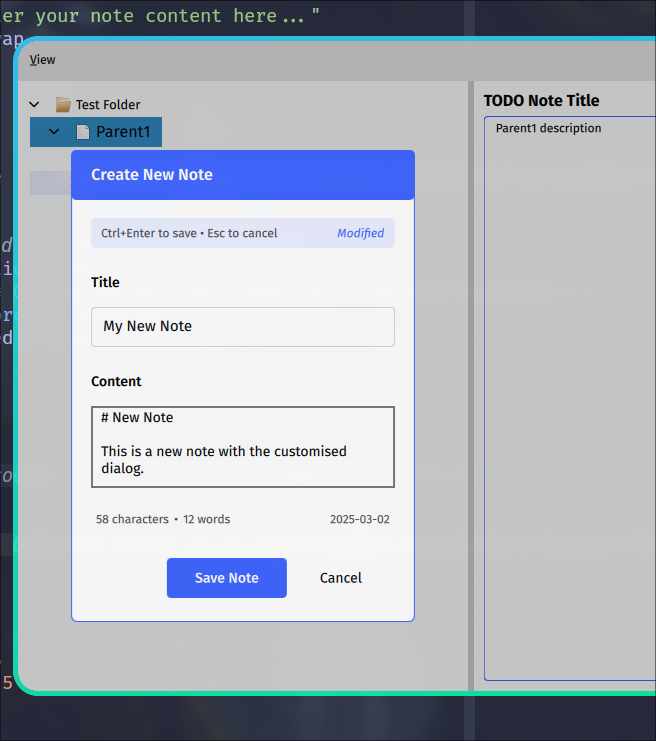

# Trees with SQLite

/// tip
This example is available as a repository in:

  * [RyanGreenup/qml_sqlite_tree_example](https://github.com/RyanGreenup/qml_sqlite_tree_example)

Sections correspond to branches.
///

## Introduction
Here we show how to connect a QML Tree with a file. SQLite is used because it's typically the correct choice and working with trees in a relational database is a bit trickier than mere files, hence it serves as a good exemplar
## Create an Initial Application ( `read_sqlite`)
### Overview

First we create an initial GUI with SQLite, this will store some notes in a SQLite database in a hierarchical fashion where Subnotes < Notes < Folders.

### Main

Because the TreeModel will hold a database connection, it must now be passed in as a property not a type:

``` python
# Create the model and expose it to QML
tree_model = TreeModel(tree_data)
engine.rootContext().setContextProperty("treeModel", tree_model)
```

Here our main Function sets up a simple Schema and exposes the treeModel defined below:

```python
import os
import signal
import sys
from pathlib import Path
from PySide6.QtGui import QGuiApplication
from PySide6.QtQml import QQmlApplicationEngine, qmlRegisterType, QQmlContext
from PySide6.QtWidgets import QApplication
from tree_model import TreeModel
from key_emitter import KeyEmitter
import sqlite3


def create_sqlite_database(conn: sqlite3.Connection):

    conn.execute('''PRAGMA journal_mode('WAL');''')
    conn.execute('''
    -- Folders table
    CREATE TABLE folders (
        id TEXT PRIMARY KEY,
        name TEXT NOT NULL,
        created_at TIMESTAMP DEFAULT CURRENT_TIMESTAMP,
        updated_at TIMESTAMP DEFAULT CURRENT_TIMESTAMP
    );''')
    conn.execute('''
    -- Notes table
    CREATE TABLE notes (
        id TEXT PRIMARY KEY,
        title TEXT NOT NULL,
        body TEXT,
        folder_id TEXT,
        parent_note_id TEXT,
        created_at TIMESTAMP DEFAULT CURRENT_TIMESTAMP,
        updated_at TIMESTAMP DEFAULT CURRENT_TIMESTAMP,

        -- Foreign key to folders table
        FOREIGN KEY (folder_id)
        REFERENCES folders (id)
        ON DELETE CASCADE,

        -- Foreign key to parent note (self-referencing)
        FOREIGN KEY (parent_note_id)
        REFERENCES notes (id)
        ON DELETE CASCADE
    );
                 ''')

    conn.execute('''
    -- Index for faster lookups
    CREATE INDEX idx_notes_folder_id ON notes (folder_id);
                 ''')

    conn.execute('''
    CREATE INDEX idx_notes_parent_note_id ON notes (parent_note_id);
                 ''')
    conn.commit()

def create_sqlite_data(conn: sqlite3.Connection):
    """Create test data with nested notes structure"""
    cursor = conn.cursor()

    # Clear existing data
    cursor.execute("DELETE FROM notes")
    cursor.execute("DELETE FROM folders")

    # Create a folder
    cursor.execute("INSERT INTO folders (id, name) VALUES (1, 'Test Folder')")

    # Create parent notes
    cursor.execute("""
        INSERT INTO notes (id, title, body, folder_id, parent_note_id)
        VALUES (1, 'Parent1', 'Parent1 description', 1, NULL)
    """)
    cursor.execute("""
        INSERT INTO notes (id, title, body, folder_id, parent_note_id)
        VALUES (2, 'Parent2', 'Parent2 description', 1, NULL)
    """)

    # Create child notes under Parent1
    cursor.execute("""
        INSERT INTO notes (id, title, body, folder_id, parent_note_id)
        VALUES (3, 'Child1', 'Child1 description', 1, 1)
    """)
    cursor.execute("""
        INSERT INTO notes (id, title, body, folder_id, parent_note_id)
        VALUES (4, 'Child2', 'Child2 description', 1, 1)
    """)

    # Create grandchild note under Child2
    cursor.execute("""
        INSERT INTO notes (id, title, body, folder_id, parent_note_id)
        VALUES (5, 'Grandchild1', 'Grandchild1 description', 1, 4)
    """)

    conn.commit()


def main():
    app = QApplication(sys.argv)
    signal.signal(signal.SIGINT, signal.SIG_DFL)

    engine = QQmlApplicationEngine()

    # Set up the database
    db_path = Path("./exemplar_data.sqlite")
    if os.path.exists(db_path):
        os.remove(db_path)

    # Create a persistent connection to the database
    conn = sqlite3.connect(db_path)
    create_sqlite_database(conn)
    create_sqlite_data(conn)


    # Create the model with database connection and expose it to QML
    tree_model = TreeModel(conn)
    engine.rootContext().setContextProperty("treeModel", tree_model)

    # Create and expose the key emitter
    key_emitter = KeyEmitter()
    engine.rootContext().setContextProperty("keyEmitter", key_emitter)

    qml_file = Path(__file__).parent / "qml" / "main.qml"
    engine.load(qml_file)

    if not engine.rootObjects():
        sys.exit(-1)

    sys.exit(app.exec())


if __name__ == "__main__":
    main()


```
### Model
#### Overview
The necessary methods for the TreeItem are:

- **Imports**
    Well, imports aren't a method but these are what's used below:

    ```python
    import sys
    import sqlite3
    from PySide6.QtCore import (
        QAbstractItemModel,
        QByteArray,
        QModelIndex,
        QObject,
        QPersistentModelIndex,
        Qt,
        Slot,
    )
    from typing import final, override
    from db_handler import Note, Folder, DatabaseHandler
    ```
- **Constructor**

    ``` python
    @final
    class TreeModel(QAbstractItemModel):
        def __init__(
            self, db_connection: sqlite3.Connection, parent: QObject | None = None
        ):
            super().__init__(parent)

            # Create database handler
            self.db_handler = DatabaseHandler(db_connection)

            # Create a dummy root item
            self.root_item = Folder(id="0", title="Root", parent=None)

            # Get folders with notes and set them as children of root
            self.tree_data: list[Folder] = self.db_handler.get_folders_with_notes()

            # Connect folders to the root item
            for folder in self.tree_data:
                folder.parent = self.root_item

            # Set the folders as children of the root item
            self.root_item.children = self.tree_data

    ```

- `ColumnCount`
    The column count provides the number of columns a given row may request. This may depend on the parent in some way and so that is provided as a parameter that can be used in the override
    ```python
    @override
    def columnCount(
        self, parent: QModelIndex | QPersistentModelIndex = QModelIndex() # pyright: ignore [reportCallInDefaultInitializer]
    ):
    ```


3. **Index Management: `index`**

    The `index` method is used to create and return the index for the specified row and column under the parent index.

    ```python
    @override
    def index(
        self,
        row: int,
        column: int,
        parent: QModelIndex | QPersistentModelIndex = QModelIndex(),  # pyright: ignore [reportCallInDefaultInitializer]
    ) -> QModelIndex:

    @override
    def parent(self, index: QModelIndex | QPersistentModelIndex):
    ```
3. **Index Management: `parent`**:
    The `parent` method, conversely to `index()`, returns the parent index for a given index, which helps in establishing the hierarchical structure.

    ```python
    @override
    def parent(self, index: QModelIndex | QPersistentModelIndex):
    ```

4. **Row Count:**

    This method determines the number of children a particular parent node has, effectively denoting the number of rows under a node.

    ```python
    @override
    def rowCount(self, parent: QModelIndex | QPersistentModelIndex = QModelIndex()):
    ```

5. **Data Retrieval:**

    The `data` method fetches the data to be displayed for each index, depending on the role.

    ```python
    @override
    def data(
        self,
        index: QModelIndex | QPersistentModelIndex,
        role: int = int(Qt.ItemDataRole.DisplayRole)
    ):
    ```

6. **Flags:**

    The `flags` method tells the view what kinds of operations can be performed on each item, like whether it can be selected or edited.

    ```python
    @override
    def flags(self, index: QModelIndex | QPersistentModelIndex):
        if not index.isValid():
            return Qt.ItemFlag.NoItemFlags
        return (
            Qt.ItemFlag.ItemIsEnabled
            | Qt.ItemFlag.ItemIsSelectable
            | Qt.ItemFlag.ItemIsEditable
        )
    ```

7. **Header Data:**

    This method provides header names for the columns.

    ```python
    @override
    def headerData(
        self,
        section: int,
        orientation: Qt.Orientation,
        role: int = int(Qt.ItemDataRole.DisplayRole)
    ):
        if orientation == Qt.Orientation.Horizontal and role == Qt.ItemDataRole.DisplayRole:
            if section == 0:
                return "Title"
        return None
    ```

8. **Role Names:**

    The `roleNames` method is used to define custom role names, making them recognisable in the model.

    ```python
    @override
    def roleNames(self):
        roles = {
            Qt.ItemDataRole.DisplayRole: QByteArray(b"display"),
            Qt.ItemDataRole.UserRole: QByteArray(b"userData"),
            Qt.ItemDataRole.EditRole: QByteArray(b"edit"),
        }
        return roles
    ```
#### Example

For this example, consider the following classes:

```python
from __future__ import annotations
import sqlite3
from datetime import datetime
from typing import final


@final
class Note:
    def __init__(
        self,
        id: str,
        title: str,
        body: str,
        folder_id: str,
        parent: Note | Folder | None = None,
        created_at: datetime | None = None,
        updated_at: datetime | None = None,
    ):
        self.id = id
        self.title = title
        self.body = body
        self.folder_id = folder_id
        self.parent = parent
        self.children: list["Note"] = []
        # If no timestamps are provided, set them to the current time
        self.created_at = created_at if created_at else datetime.now()
        self.updated_at = updated_at if updated_at else datetime.now()


@final
class Folder:
    def __init__(
        self,
        id: str,
        title: str,
        parent: Folder | None,
        created_at: datetime | None = None,
        updated_at: datetime | None = None,
    ):
        self.id = id
        self.title = title
        self.children: list[Folder | Note] = []
        self.parent = parent
        # If no timestamps are provided, set them to the current time
        self.created_at = created_at if created_at else datetime.now()
        self.updated_at = updated_at if updated_at else datetime.now()
```

Note that this classes store a reference to the children and parent of an item in the tree. This is required for the TreeModel and allows it to build the tree efficiently. I have tried and failed to build a tree efficiently with QT Widgets, you're better of using a Model and calling it a day. See generally [^1740816397] [^1740816424]  [^1740816431].

[^1740816431]: [Qt Core 6.8.2](https://doc.qt.io/qt-6/qtcore-index.html)

[^1740816424]: [PySide6.QtCore.QAbstractItemModel - Qt for Python](https://doc.qt.io/qtforpython-6/PySide6/QtCore/QAbstractItemModel.html#PySide6.QtCore.QAbstractItemModel.parent)

[^1740816397]: [TreeView QML Type | Qt Quick 6.8.2](https://doc.qt.io/qt-6/qml-qtquick-treeview.html)

We'll implement the logic to get this out of the database shortly, for now assume the following is already implemented:

```python
# Create database handler
self.db_handler = DatabaseHandler(db_connection)
# Get folders with notes and set them as children of root
self.tree_data: list[Folder] = self.db_handler.get_folders_with_notes()
```


Putting these together gives:

```python

import sys
import sqlite3
from PySide6.QtCore import (
    QAbstractItemModel,
    QByteArray,
    QModelIndex,
    QObject,
    QPersistentModelIndex,
    Qt,
    Slot,
)
from typing import final, override
from db_handler import Note, Folder, DatabaseHandler


@final
class TreeModel(QAbstractItemModel):
    def __init__(
        self, db_connection: sqlite3.Connection, parent: QObject | None = None
    ):
        super().__init__(parent)

        # Create database handler
        self.db_handler = DatabaseHandler(db_connection)

        # Create a dummy root item
        self.root_item = Folder(id="0", title="Root", parent=None)

        # Get folders with notes and set them as children of root
        self.tree_data: list[Folder] = self.db_handler.get_folders_with_notes()

        # Connect folders to the root item
        for folder in self.tree_data:
            folder.parent = self.root_item

        # Set the folders as children of the root item
        self.root_item.children = self.tree_data  # pyright: ignore [reportAttributeAccessIssue]

    @override
    def columnCount(
        self, parent: QModelIndex | QPersistentModelIndex = QModelIndex() # pyright: ignore [reportCallInDefaultInitializer]
    ):
        fixed_columns = 1
        if parent.isValid():
            # Assuming the parent has a .columnCount() method we could use
            # We may want to match
            # parent_item = self._get_item(parent)
            # return parent_item.columnCount()
            return fixed_columns

        # Change this if you want more columns
        return fixed_columns

    def _get_item(self, index: QModelIndex | QPersistentModelIndex) -> Folder | Note:
        untyped_item = index.internalPointer()  # pyright: ignore[reportAny]
        if not (isinstance(untyped_item, Folder) or isinstance(untyped_item, Note)):
            print("Error, Item in Tree has wrong type, this is a bug!", file=sys.stderr)
        item: Folder | Note = untyped_item
        return item

    @override
    def data(
        self,
        index: QModelIndex | QPersistentModelIndex,
        role: int = int(
            Qt.ItemDataRole.DisplayRole
        ),  # pyright: ignore [reportCallInDefaultInitializer]
    ):
        if not index.isValid():
            return None

        if (
            role != Qt.ItemDataRole.DisplayRole
            and role != Qt.ItemDataRole.UserRole
            and role != Qt.ItemDataRole.EditRole
        ):
            return None

        column: int = index.column()
        row: int = index.row()
        _ = row
        item = self._get_item(index)

        match column:
            case 0:
                return item.title
            case 1:
                return item.id
            case _:
                return None

    @override
    def flags(self, index: QModelIndex | QPersistentModelIndex):
        if not index.isValid():
            return Qt.ItemFlag.NoItemFlags

        return (
            Qt.ItemFlag.ItemIsEnabled
            | Qt.ItemFlag.ItemIsSelectable
            | Qt.ItemFlag.ItemIsEditable
        )

    # Section is the column
    @override
    def headerData(
        self,
        section: int,
        orientation: Qt.Orientation,
        role: int = int(Qt.ItemDataRole.DisplayRole),  # pyright: ignore [reportCallInDefaultInitializer]
    ):
        if (
            orientation == Qt.Orientation.Horizontal
            and role == Qt.ItemDataRole.DisplayRole
        ):
            match section:
                case 0:
                    return "Title"
                case _:
                    return None

        return None

    @override
    def index(
        self,
        row: int,
        column: int,
        parent: QModelIndex | QPersistentModelIndex = QModelIndex(),  # pyright: ignore [reportCallInDefaultInitializer]
    ) -> QModelIndex:
        if not self.hasIndex(row, column, parent):
            return QModelIndex()

        # Return the Root Item or the parent of the current item
        if not parent.isValid():
            parent_item = self.root_item
        else:
            parent_item = self._get_item(parent)

        # Get the children of the parent
        child_items = parent_item.children
        # Get the Specific child item
        child_item = child_items[row]
        # Create an index from that child item
        child_index = self.createIndex(row, column, child_item)

        # Return that index
        return child_index

    @override
    def parent(self, index: QModelIndex | QPersistentModelIndex):  # pyright: ignore [reportIncompatibleMethodOverride]
        # Note the ignore is likely a stubs error, docs suggests this is correct
        # https://doc.qt.io/qtforpython-6/PySide6/QtCore/QAbstractItemModel.html#PySide6.QtCore.QAbstractItemModel.parent
        if not index.isValid():
            return QModelIndex()

        child_item: Folder | Note = self._get_item(index)
        parent_item = child_item.parent

        if parent_item is None or parent_item == self.root_item:
            return QModelIndex()

        # Find the row of the parent in its parent's children
        if parent_item.parent is not None:
            parent_parent = parent_item.parent
            row = parent_parent.children.index(parent_item)  # pyright: ignore [reportArgumentType]
        else:
            # This should not happen with our structure, but just in case
            row = 0

        return self.createIndex(row, 0, parent_item)

    @override
    def rowCount(self,
                 parent: QModelIndex | QPersistentModelIndex = QModelIndex()  # pyright: ignore [reportCallInDefaultInitializer]
                 ):
        if parent.column() > 0:
            return 0

        if not parent.isValid():
            parent_item = self.root_item
        else:
            parent_item = self._get_item(parent)

        return len(parent_item.children)

    @override
    def roleNames(self):
        roles = {
            Qt.ItemDataRole.DisplayRole: QByteArray(b"display"),
            Qt.ItemDataRole.UserRole: QByteArray(b"userData"),
            Qt.ItemDataRole.EditRole: QByteArray(b"edit"),
        }
        r: dict[int, QByteArray] = roles  # pyright: ignore [reportAssignmentType]
        return r
```
### Database Handler

The database handler is a little naive. It would likely be more efficient to use a closure table in order to start with the root level items first, see generally [^1740816699].

[^1740816699]: [Hierarchical Data in SQL: The Ultimate Guide - Database Star](https://www.databasestar.com/hierarchical-data-sql/#Which_Method_Should_I_Use)

```python
@final
class DatabaseHandler:
    def __init__(self, connection: sqlite3.Connection):
        self.connection = connection
        self.cursor = connection.cursor()

    def get_notes_recursive(
        self, parent_id: str | None = None, parent: Note | Folder | None = None
    ) -> list[Note]:
        """
        Recursively get notes in a nested structure

        Args:
            parent_id: ID of the parent note (None for top-level notes)
            parent: Parent Note or Folder object

        Returns:
            List of Note objects with their children
        """
        # Get notes with the specified parent_id
        if parent_id is None:
            _ = self.cursor.execute(
                "SELECT id, title, body, folder_id FROM notes WHERE parent_note_id IS NULL"
            )
        else:
            _ = self.cursor.execute(
                "SELECT id, title, body, folder_id FROM notes WHERE parent_note_id = ?",
                (parent_id,),
            )

        result: list[Note] = []
        for row in self.cursor.fetchall():  # pyright: ignore[reportAny]
            note_id: str
            title: str
            folder_id: str
            body: str
            note_id, title, body, folder_id = row

            # Create a Note object
            note = Note(
                id=note_id, title=title, body=body, folder_id=folder_id, parent=parent
            )

            # Check if this note has children
            _ = self.cursor.execute(
                "SELECT COUNT(*) FROM notes WHERE parent_note_id = ?", (note_id,)
            )
            has_children: bool = self.cursor.fetchone()[0] > 0

            if has_children:
                # Get children recursively and attach them to the note
                note.children = self.get_notes_recursive(note_id, note)
                result.append(note)
            else:
                result.append(note)

        return result

    def get_folders_with_notes(self) -> list[Folder]:
        """
        Get all folders with their notes

        Returns:
            List of Folder objects with their notes
        """
        # Get all folders
        _ = self.cursor.execute("SELECT id, name FROM folders")

        result: list[Folder] = []
        for row in self.cursor.fetchall():  # pyright: ignore[reportAny]
            folder_id: str
            title: str
            folder_id, title = row

            # Create a Folder object
            folder = Folder(id=folder_id, title=title, parent=None)

            # Get top-level notes in this folder
            folder.children = []
            _ = self.cursor.execute(
                "SELECT id, title, body  FROM notes WHERE folder_id = ? AND parent_note_id IS NULL",
                (folder_id,),
            )

            for note_row in self.cursor.fetchall():  # pyright: ignore[reportAny]
                note_id: str
                body: str
                note_id, title, body = note_row

                # Create a Note object
                note = Note(
                    id=note_id,
                    title=title,
                    body=body,
                    folder_id=folder_id,
                    parent=folder,
                )

                # Check if this note has children
                _ = self.cursor.execute(
                    "SELECT COUNT(*) FROM notes WHERE parent_note_id = ?", (note_id,)
                )
                has_children: bool = self.cursor.fetchone()[0] > 0

                if has_children:
                    # Get children recursively
                    note.children = self.get_notes_recursive(note_id, note)

                folder.children.append(note)

            result.append(folder)

        return result
```
### QML
#### Overview
This is a simple application that displays a note tree and the corresponding content. Nothing is connected yet as we'll do that next.

Any components declared here will not be repeated, it's assumed they have been moved into separate files.
#### Code

```qml
import QtQuick
import QtQuick.Window
import QtQuick.Controls
import QtQuick.Controls.Universal
import QtQuick.Layouts

ApplicationWindow {
    id: root
    // Custom handle component for SplitView
    width: 640
    height: 480
    visible: true
    title: "Animated Rectangle Demo"
    property int border_width

    // Menu with a delegate to show Keyboard Shortcuts
    component MenuWithKbd: Menu {
        id: my_menu
        delegate: MenuItem {
            id: control

            contentItem: Item {
                anchors.centerIn: parent

                function transformString(inputString) {
                    // Find the index of '&' in the input string
                    const ampIndex = inputString.indexOf('&');

                    if (ampIndex !== -1 && ampIndex + 1 < inputString.length) {
                        // Get the character following '&'
                        const charToUnderline = inputString.charAt(ampIndex + 1);

                        // Construct the new string with the character underlined
                        const transformedString = inputString.slice(0, ampIndex) + `<u>${charToUnderline}</u>` + inputString.slice(ampIndex + 2);

                        return transformedString;
                    }

                    // Return the original string if no '&' is present
                    return inputString;
                }

                Text {
                    text: transformString(control.text)
                    // text: "My <u>S</u>tring"
                    anchors.left: parent.left
                    // color: "white"
                }

                Text {
                    text: control.action.shortcut
                    anchors.right: parent.right
                    // color: "white"
                }
            }
        }
    }

    // Menu Bar
    menuBar: MenuBar {
        id: menuBar
        MenuWithKbd {
            id: contextMenu
            title: "&Help"

            Action {
                text: "&Usage guide"
                shortcut: "F1"
                onTriggered: console.log("Usage Guide")
            }
        }
        MenuWithKbd {
            id: menuEdit
            title: qsTr("&Edit")
            Action {
                text: qsTr("&Undo")
                shortcut: "Ctrl+U"
                onTriggered: console.log("Undo Triggered")
            }
        }
    }

    // Tree Delegate to display Tree Items
    component MyTreeDelegate: Item {
        id: tree_delegate
        implicitWidth: padding + label.x + label.implicitWidth + padding
        implicitHeight: label.implicitHeight * 1.5

        readonly property real indentation: 20
        readonly property real padding: 5

        // Assigned to by TreeView:
        required property TreeView treeView
        required property bool isTreeNode
        required property bool expanded
        required property bool hasChildren
        required property int depth
        required property int row
        required property int column
        required property bool current
        required property string display

        // Rotate indicator when expanded by the user
        // (requires TreeView to have a selectionModel)
        property Animation indicatorAnimation: NumberAnimation {
            target: indicator
            property: "rotation"
            from: tree_delegate.expanded ? 0 : 90
            to: tree_delegate.expanded ? 90 : 0
            duration: 200
            easing.type: Easing.OutQuart
        }
        TableView.onPooled: indicatorAnimation.complete()
        TableView.onReused: if (current)
            indicatorAnimation.start()
        onExpandedChanged: indicator.rotation = expanded ? 90 : 0

        function is_current_item() {
            return tree_delegate.row === tree_delegate.treeView.currentRow;
        }

        // Handle right-click to show context menu
        TapHandler {
            acceptedButtons: Qt.RightButton
            onTapped: function (eventPoint) {
                // tree_delegate.treeView.currentRow = tree_delegate.row;
                contextMenu.x = eventPoint.position.x;
                contextMenu.y = eventPoint.position.y;
                contextMenu.open();
            }
        }

        function item_opacity() {
            if (tree_delegate.is_current_item()) {
                return 1;
            }
            if (tree_delegate.treeView.alternatingRows && tree_delegate.row % 2 !== 0) {
                return 0.1;
            } else {
                return 0;
            }
        }

        Rectangle {
            id: background
            anchors.fill: parent
            color: tree_delegate.is_current_item() ? palette.highlight : Universal.accent
            opacity: tree_delegate.item_opacity()
        }

        Label {
            id: indicator
            x: padding + (tree_delegate.depth * tree_delegate.indentation)
            anchors.verticalCenter: parent.verticalCenter
            visible: tree_delegate.isTreeNode && tree_delegate.hasChildren
            text: ""

            TapHandler {
                onSingleTapped: {
                    let index = tree_delegate.treeView.index(tree_delegate.row, tree_delegate.column);
                    tree_delegate.treeView.selectionModel.setCurrentIndex(index, ItemSelectionModel.NoUpdate);
                    tree_delegate.treeView.toggleExpanded(tree_delegate.row);
                }
            }
        }

        Label {
            id: label
            x: padding + (tree_delegate.isTreeNode ? (tree_delegate.depth + 1) * tree_delegate.indentation : 0)
            anchors.verticalCenter: parent.verticalCenter
            width: parent.width - padding - x
            clip: true
            text: tree_delegate.display // model.display works but qmlls doesn't like it.
            font.pointSize: tree_delegate.is_current_item() ? 12 : 10

            // Animate font size changes
            Behavior on font.pointSize {
                NumberAnimation {
                    duration: 200
                    easing.type: Easing.OutQuad
                }
            }
        }

        // Context menu for tree items
        MenuWithKbd {
            id: contextMenu

            Action {
                text: qsTr("&Expand")
                enabled: tree_delegate.isTreeNode && tree_delegate.hasChildren && !tree_delegate.expanded
                onTriggered: {
                    let index = tree_delegate.treeView.index(tree_delegate.row, tree_delegate.column);
                    tree_delegate.treeView.expand(tree_delegate.row);
                }
            }

            Action {
                text: qsTr("C&ollapse")
                enabled: tree_delegate.isTreeNode && tree_delegate.hasChildren && tree_delegate.expanded
                onTriggered: {
                    let index = tree_delegate.treeView.index(tree_delegate.row, tree_delegate.column);
                    tree_delegate.treeView.collapse(tree_delegate.row);
                }
            }

            MenuSeparator {}

            Action {
                text: qsTr("&Copy Text")
                onTriggered: {}
                shortcut: "C"
            }

        }
    }

    // Tree View to display Notes with some Default Keybindings
    component MyTreeView: TreeView {
        id: treeView
        anchors.fill: parent
        anchors.margins: 10
        clip: true

        // Signal to emit when the current item changes
        signal currentItemChanged(string statistics)

        // NOTE the getNoteBody function is not yet implemented.
        selectionModel: ItemSelectionModel {
            onCurrentChanged: {
                console.log("Current Item: {Row: " + row + ", Column: " + column + "}")
                // When current index changes, emit the signal with item statistics
                if (currentIndex.row >= 0) {
                    let stats = treeModel.getNoteBody(currentIndex.row, currentIndex.column);
                    treeView.currentItemChanged(stats);
                }
            }
        }

        // Connect to our Python model
        model: treeModel

        delegate: MyTreeDelegate {}

        // Connect to the KeyEmitter when the component is created
        Component.onCompleted: {
            keyEmitter.setView(treeView);
        }

        // Add keyboard shortcuts
        Keys.onPressed: function (event) {
            // 'j' key to move down (like Down arrow)
            if (event.key === Qt.Key_J) {
                // Use the KeyEmitter to simulate a Down key press
                keyEmitter.emitDownKey();
                event.accepted = true;
            } else
            // 'k' key to move up (like Up arrow)
            if (event.key === Qt.Key_K) {
                keyEmitter.emitUpKey();
                event.accepted = true;
            } else
            // 'h' key to collapse/move left
            if (event.key === Qt.Key_H) {
                keyEmitter.emitLeftKey();
                event.accepted = true;
            } else
            // 'l' key to expand/move right
            if (event.key === Qt.Key_L) {
                keyEmitter.emitRightKey();
                event.accepted = true;
            }
        }
    }


    // The Main View
    SplitView {
        orientation: Qt.Horizontal
        anchors.fill: parent
        Rectangle {
            id: rect_1
            SplitView.preferredWidth: parent.width * 0.39
            color: Universal.background
            border.color: Universal.accent

            // Make sure to only focus treeView
            border.width: treeView.activeFocus ? 10 : 0
            focus: false
            activeFocusOnTab: false

            MyTreeView {
                id: treeView
                anchors.fill: parent
                topMargin: root.border_width + 2
                leftMargin: root.border_width + 2

                // Connect to the signal to log statistics when item changes
                onCurrentItemChanged: function (note_body) {
                    console.log("Current item changed. Statistics:", note_body);
                }
            }
        }

        Rectangle {
            id: detailsRect
            SplitView.preferredWidth: parent.width * 0.61
            color: Universal.background

            // Allow Focus
            focus: true
            activeFocusOnTab: true
            border.width: activeFocus ? 10 : 0
            border.color: Universal.accent

            // Display area for the current Note
            Rectangle {
                anchors.centerIn: parent
                anchors.margins: 10

                Label {
                    text: "TODO Note Content"
                    font.bold: true
                    font.pointSize: 12
                }
            }
        }
    }
}
```

#### Using Icons for Notes and Folders
##### QML
Modify the tree delegate to include a built in Icon:

```qml
        // Item type icon
        Image {
            id: itemIcon
            x: padding + (tree_delegate.isTreeNode ? (tree_delegate.depth + 1) * tree_delegate.indentation : 0)
            anchors.verticalCenter: parent.verticalCenter
            width: 16
            height: 16
            source: {
                // Use decoration role to determine icon
                if (tree_delegate.decoration === "folder") {
                    return "qrc:///qt-project.org/styles/commonstyle/images/standardbutton-open-16.png"
                } else {
                    return "qrc:///qt-project.org/styles/commonstyle/images/file-16.png"
                }
            }
            opacity: tree_delegate.is_current_item() ? 1.0 : 0.8
        }

        Label {
            id: label
            x: itemIcon.x + itemIcon.width + 5 // Position after the icon with some spacing
            anchors.verticalCenter: parent.verticalCenter
            width: parent.width - padding - x
            clip: true
            text: tree_delegate.display // model.display works but qmlls doesn't like it.
            font.pointSize: tree_delegate.is_current_item() ? 12 : 10

            // Animate font size changes
            Behavior on font.pointSize {
                NumberAnimation {
                    duration: 200
                    easing.type: Easing.OutQuad
                }
            }
        }
```


And add a decoration role to the `data` method of the `treeModel` class:

```python
@final
class TreeModel(QAbstractItemModel):
    # ...
    # ...
    # ...
    @override
    def data(
        self,
        index: QModelIndex | QPersistentModelIndex,
        role: int = int(
            Qt.ItemDataRole.DisplayRole
        ),  # pyright: ignore [reportCallInDefaultInitializer]
    ):
        if not index.isValid():
            return None

        if role not in [
            Qt.ItemDataRole.DisplayRole,
            Qt.ItemDataRole.UserRole,
            Qt.ItemDataRole.EditRole,
            Qt.ItemDataRole.DecorationRole,
            ]:
            return None

        column: int = index.column()
        row: int = index.row()
        _ = row
        item = self._get_item(index)

        # Used to set an icon
        if role == Qt.ItemDataRole.DecorationRole and column == 0:
            return "folder" if isinstance(item, Folder) else "note"

        if item is None:
            return None
        else:
            match column:
                case 0:
                    return item.title
                case 1:
                    return item.id
                case _:
                    return None
    # ...
    # ...
    # ...
```
## Displaying Note Content With Signals
Currently the application does nothing, next we need to emit a signal that contains the note content.

### Create a Slot
#### TreeView
In the Treeview the SelectionModel has the `onCurrentChanged` field [^1740820703]

[^1740820703]: In fact, The treeView itself emits a `CurrentChanged` signal that the `ItemSelectionModel` is automatically connected to when assigned to the `selectionModel` field. We are emitting a new signal when we recieve that. This is another example of how QML differs from QTWidgets, it pushes you to create more signals and slots and helps limit dereferencing indicies that may not exist.

```qml
    selectionModel: ItemSelectionModel {
        onCurrentChanged: function(current, previous) {
            // `current` is expected to be of type QModelIndex
            if (current.valid) {
                // Get details from the model and emit the signal
                let details = treeModel.getItemDetails(current);
                treeView.currentItemChanged(details);
            }
        }
    }
```
Here we know the index, so in the TreeModel we need to create a slot that takes in the QModelIndex and returns a string `@Slot(QModelIndex, result=str)`, in this case:

```python
@Slot(QModelIndex, result=str)
def getItemDetails(self, index: QModelIndex) -> str:
    """Get details for the selected item (note body or folder info)"""
    if not index.isValid():
        return "No item selected"

    item = self._get_item(index)
    if item is None:
        return "Invalid item"

    if isinstance(item, Note):
        return item.body
    elif isinstance(item, Folder):
        # For folders, return some basic info
        child_count = len(item.children)
        return f"Folder: {item.title}\nContains {child_count} items"
    else:
        return "Unknown item type"
```

Now the second rectangle can be improved to display the content and respond to that signal:

```qml
Rectangle {
    id: detailsRect
    SplitView.preferredWidth: parent.width * 0.61
    color: Universal.background

    // Allow Focus
    focus: true
    activeFocusOnTab: true
    border.width: activeFocus ? 10 : 0
    border.color: Universal.accent

    // Display area for the current item statistics
    ColumnLayout {
        anchors.fill: parent
        anchors.margins: 10

        Label {
            text: "TODO Note Title"
            font.bold: true
            font.pointSize: 12
        }

        ScrollView {
            Layout.fillWidth: true
            Layout.fillHeight: true

            TextArea {
                id: noteBody
                readOnly: true
                wrapMode: TextEdit.Wrap
                text: "Select an item in the tree to view statistics"

                background: Rectangle {
                    color: Universal.background
                    border.color: Universal.accent
                    border.width: 1
                    radius: 4
                }
            }
        }
    }

    // Connect to the tree view's signal
    Connections {
        target: treeView
        /**
         * Updates the text of the noteBody element with the provided note body text.
         *
         * @param {string} note_body_text - The text to be set as the note body.
         */
        function onCurrentItemChanged(note_body) {
            noteBody.text = note_body;
        }
    }
}
```

So overall the `main.qml` would be:


```qml
import QtQuick
import QtQuick.Window
import QtQuick.Controls
import QtQuick.Controls.Universal
import QtQuick.Layouts

ApplicationWindow {
    id: root
    // Custom handle component for SplitView
    width: 640
    height: 480
    visible: true
    title: "Animated Rectangle Demo"
    property int border_width
    property bool dark_mode
    Universal.theme: root.dark_mode ? Universal.Dark : Universal.Light

    // Menu Bar
    menuBar: AppMenu {}

    // The Main View
    SplitView {
        orientation: Qt.Horizontal
        anchors.fill: parent
        Rectangle {
            id: rect_1
            SplitView.preferredWidth: parent.width * 0.39
            color: Universal.background
            border.color: Universal.accent

            // Make sure to only focus treeView
            border.width: treeView.activeFocus ? 10 : 0
            focus: false
            activeFocusOnTab: false

            MyTreeView {
                id: treeView
                anchors.fill: parent
                topMargin: root.border_width + 2
                leftMargin: root.border_width + 2

                // Connect to the signal to log statistics when item changes
                onCurrentItemChanged: function (note_body) {
                    console.log("Current item changed. Statistics:", note_body);
                }
            }
        }

        Rectangle {
            id: detailsRect
            SplitView.preferredWidth: parent.width * 0.61
            color: Universal.background

            // Allow Focus
            focus: true
            activeFocusOnTab: true
            border.width: activeFocus ? 10 : 0
            border.color: Universal.accent

            // Display area for the current item statistics
            ColumnLayout {
                anchors.fill: parent
                anchors.margins: 10

                Label {
                    text: "TODO Note Title"
                    font.bold: true
                    font.pointSize: 12
                }

                ScrollView {
                    Layout.fillWidth: true
                    Layout.fillHeight: true

                    TextArea {
                        id: noteBody
                        readOnly: true
                        wrapMode: TextEdit.Wrap
                        text: "Select an item in the tree to view statistics"

                        background: Rectangle {
                            color: Universal.background
                            border.color: Universal.accent
                            border.width: 1
                            radius: 4
                        }
                    }
                }
            }

            // Connect to the tree view's signal
            Connections {
                target: treeView
                /**
                 * Updates the text of the noteBody element with the provided note body text.
                 *
                 * @param {string} note_body_text - The text to be set as the note body.
                 */
                function onCurrentItemChanged(note_body) {
                    noteBody.text = note_body;
                }
            }
        }
    }
}
```

See the full code on the `read_sqlite` branch of the git repository which corresponds to the code this far.
## Creating New Items
### Overview
Here we show how to create New Note Items. The logic for Folders is much the same so is omitted.
### Notes
#### Add a Context Menu
In the context menu add the following to pass the index into a slot of the model:

```qml
Action {
                text: qsTr("Create &New Note")
                enabled: true
                onTriggered: {
                    // WARNING: This will work only for the context menu
                    // let index = tree_delegate.treeView.index(tree_delegate.row, tree_delegate.column);
                    // This will work for both
                    let index = tree_delegate.treeView.selectionModel.currentIndex
                    // This type isn't available so it can't be `required`, however, it's passed to the delegate
                    treeModel.createNewNote(index);
                }
                shortcut: "N"
            }
```
#### Add a Slot
In the model add a slot that will:

1. Create a new note
2. Insert an item into the tree

One can also request the entire tree to be rebuilt, however, this requires tracking which items are folded and unfolded. In the past I experimented with tracking unfolded items with a `dict[id: str, folded: bool]`. I found this to be more complex that it was worth. I recommend inserting the item wherever and instead offering the user a refresh command to rebuild the tree, it's simpler.


```python
    @Slot(QModelIndex)
    def createNewNote(self, parent_index: QModelIndex) -> None:
        """Create a new note under the specified parent item"""
        if not parent_index.isValid():
            return

        parent_item = self._get_item(parent_index)
        if parent_item is None:
            return

        # Create a default title and body for the new note
        new_title = "New Note"
        new_body = "Enter your note here..."

        # Begin inserting rows
        parent_row = parent_index.row()
        parent_parent = self.parent(parent_index)

        # Get the position where the new note will be inserted
        insert_position = len(parent_item.children)

        # Begin inserting rows
        self.beginInsertRows(parent_index, insert_position, insert_position)

        # Create the new note in the database and get the Note object
        new_note = self.db_handler.create_note(
            title=new_title,
            body=new_body,
            parent=parent_item
        )

        # End inserting rows
        self.endInsertRows()
```
#### Implement the Database Logic

In the database, the following method will create a new note.

```python
    def create_note(
        self,
        title: str,
        body: str,
        parent: Note | Folder
    ) -> Note:
        """
        Create a new note underneath a given parent item

        Args:
            title: Title of the new note
            body: Content of the new note
            parent: Parent item (Note or Folder) under which to create the note

        Returns:
            The newly created Note object
        """
        # Generate a unique ID for the new note
        import uuid
        note_id = str(uuid.uuid4())

        # Get the current timestamp
        now = datetime.now()

        # Determine folder_id and parent_note_id based on parent type
        folder_id = None
        parent_note_id = None

        if isinstance(parent, Folder):
            folder_id = parent.id
        elif isinstance(parent, Note):
            folder_id = parent.folder_id
            parent_note_id = parent.id
        else:
            raise TypeError("Parent must be either a Note or Folder")

        # Insert the new note into the database
        self.cursor.execute(
            """
            INSERT INTO notes (id, title, body, folder_id, parent_note_id, created_at, updated_at)
            VALUES (?, ?, ?, ?, ?, ?, ?)
            """,
            (note_id, title, body, folder_id, parent_note_id, now, now)
        )
        self.connection.commit()

        # Create and return the Note object
        note = Note(
            id=note_id,
            title=title,
            body=body,
            folder_id=folder_id,
            parent=parent,
            created_at=now,
            updated_at=now
        )

        # Add the new note to the parent's children
        parent.children.append(note)

        return note

```
#### Creating a Dialog
Next, the user requires a dialog to enter the title for the new note

##### Modify the View
###### Create a Property to Store the ID
In the treeView create a property to store the index details before the popup has occured (in which case the tree focus may change):

```qml
// Property to store the parent index for new notes
property var currentParentIndex: null
```
###### Declare the Dialog
Inside the tree, declare a new note dialog, we'll implement this in a moment, for now it's important to note that this must recieve a signal from the dialog to actually create the new note. This way the user can cancel the new note creation from the popup dialog:

```qml
NewNoteDialog {
    id: newNoteDialog

    onNoteCreated: function(title, body) {
        if (treeView.currentParentIndex) {
            treeModel.createNoteWithDetails(treeView.currentParentIndex, title, body);
        }
    }
}

```
###### Context Menu
The context menu should now have the following action

```qml
Action {
    text: qsTr("Create &New Note")
    enabled: true
    onTriggered: {
        // Get the current index
        let index = tree_delegate.treeView.selectionModel.currentIndex

        // Store the current index for later use
        treeView.currentParentIndex = index

        // Show the dialog
        newNoteDialog.open()
    }
    shortcut: "N"
}
```
##### Simple Dialog

The dialog should emit a signal to create the new note, here is a simple example of such a popup dialog. Note the use of keybindings to accept and reject the dialog:

```qml
import QtQuick
import QtQuick.Controls
import QtQuick.Controls.Universal
import QtQuick.Layouts
import QtQuick.Window

Dialog {
    // Remove explicit theme setting to inherit from parent
    id: newNoteDialog
    title: "Create New Note"
    modal: true
    standardButtons: Dialog.Ok | Dialog.Cancel
    width: Math.min(parent.width * 0.8, 500)
    height: Math.min(parent.height * 0.8, 400)
    anchors.centerIn: parent
    focus: true

    // Properties to store the input values
    property string noteTitle: titleField.text
    property string noteBody: bodyField.text

    // Signal emitted when the dialog is accepted with valid data
    signal noteCreated(string title, string body)

    onAccepted: {
        if (titleField.text.trim() !== "") {
            noteCreated(titleField.text, bodyField.text);
        }
    }

    // Handle key events for the dialog
    Keys.onPressed: function (event) {
        if (event.key === Qt.Key_Escape) {
            reject();
            event.accepted = true;
        } else if (event.key === Qt.Key_Return && (event.modifiers & Qt.ControlModifier)) {
            accept();
            event.accepted = true;
        }
    }

    // Add key handlers to the text fields as well
    Shortcut {
        sequence: StandardKey.Cancel
        onActivated: newNoteDialog.reject()
    }

    Shortcut {
        sequence: "Ctrl+Return"
        onActivated: newNoteDialog.accept()
    }

    // Reset fields when dialog is opened
    onOpened: {
        titleField.text = "New Note";
        bodyField.text = "Enter your note here...";
        titleField.selectAll();
        titleField.forceActiveFocus();
    }

    contentItem: ColumnLayout {
        spacing: 10

        Label {
            text: "Title:"
            Layout.fillWidth: true
        }

        TextField {
            id: titleField
            Layout.fillWidth: true
            placeholderText: "Enter note title"
            selectByMouse: true

            // Select all text when focused
            onActiveFocusChanged: {
                if (activeFocus) {
                    selectAll();
                }
            }

            // Move to body field when Tab is pressed
            Keys.onTabPressed: function(event) {
                bodyField.forceActiveFocus();
                event.accepted = true;
            }
        }

        Label {
            text: "Content:"
            Layout.fillWidth: true
        }

        ScrollView {
            Layout.fillWidth: true
            Layout.fillHeight: true

            TextArea {
                id: bodyField
                placeholderText: "Enter note content"
                wrapMode: TextEdit.Wrap
                selectByMouse: true

                // Move to title field when Shift+Tab is pressed
                Keys.onPressed: function (event) {
                    if (event.key === Qt.Key_Tab && (event.modifiers & Qt.ShiftModifier)) {
                        titleField.forceActiveFocus();
                        event.accepted = true;
                    }
                }
            }
        }
    }
}
```


##### Something more Sophisticated




``` python
import QtQuick
import QtQuick.Controls
import QtQuick.Controls.Universal
import QtQuick.Layouts
import QtQuick.Window
import QtQuick.Effects

Dialog {
    id: newNoteDialog
    title: "Create New Note"
    modal: true
    closePolicy: Popup.CloseOnEscape
    width: Math.min(parent.width * 0.8, 600)
    height: Math.min(parent.height * 0.8, 500)
    anchors.centerIn: parent
    focus: true
    padding: 20

    // Some Custom Styling
    background: Rectangle {
        color: Universal.background
        border.color: Universal.accent
        border.width: 1
        radius: 6

        layer.enabled: true
        layer.effect: MultiEffect {
            shadowEnabled: true
            shadowColor: "#80000000"
            shadowHorizontalOffset: 0
            shadowVerticalOffset: 3
            shadowBlur: 12
        }
    }

    // Blue header stripe
    header: Rectangle {
        color: Universal.accent
        height: 50
        radius: 5

        Label {
            text: newNoteDialog.title
            color: "white"
            font.pixelSize: 16
            font.weight: Font.DemiBold
            anchors.verticalCenter: parent.verticalCenter
            anchors.left: parent.left
            anchors.leftMargin: 20
        }
    }

    // Store the input values
    property string noteTitle: titleField.text
    property string noteBody: bodyField.text
    property bool isModified: false

    // Signal emitted when the dialog is accepted
    signal noteCreated(string title, string body)

    // Custom footer; styled buttons
    footer: DialogButtonBox {
        alignment: Qt.AlignRight
        background: Rectangle {
            color: "transparent"
        }

        Button {
            text: "Cancel"
            DialogButtonBox.buttonRole: DialogButtonBox.RejectRole
            flat: true

            contentItem: Text {
                text: parent.text
                font.pixelSize: 14
                color: parent.hovered ? Universal.accent : Universal.foreground
                horizontalAlignment: Text.AlignHCenter
                verticalAlignment: Text.AlignVCenter
            }

            background: Rectangle {
                implicitWidth: 100
                implicitHeight: 40
                color: parent.hovered ? Qt.lighter(Universal.background, 1.1) : "transparent"
                border.color: parent.hovered ? Universal.accent : "transparent"
                border.width: 1
                radius: 4
            }
        }

        Button {
            id: saveButton
            text: "Save Note"
            DialogButtonBox.buttonRole: DialogButtonBox.AcceptRole
            enabled: titleField.text.trim() !== ""

            contentItem: Text {
                text: parent.text
                font.pixelSize: 14
                font.weight: Font.Medium
                color: parent.enabled ? "white" : Qt.darker("white", 1.5)
                horizontalAlignment: Text.AlignHCenter
                verticalAlignment: Text.AlignVCenter
            }

            background: Rectangle {
                implicitWidth: 120
                implicitHeight: 40
                color: parent.enabled ? (parent.hovered ? Qt.lighter(Universal.accent, 1.1) : Universal.accent) : Qt.darker(Universal.accent, 1.5)
                radius: 4

                Behavior on color {
                    ColorAnimation { duration: 150 }
                }
            }
        }
    }

    onAccepted: {
        if (titleField.text.trim() !== "") {
            noteCreated(titleField.text, bodyField.text)
        }
    }

    // Handle key events for the dialog
    Keys.onPressed: function(event) {
        if (event.key === Qt.Key_Escape) {
            reject()
            event.accepted = true
        } else if (event.key === Qt.Key_Return && (event.modifiers & Qt.ControlModifier)) {
            if (titleField.text.trim() !== "") {
                accept()
                event.accepted = true
            }
        }
    }

    // Add key handlers to the text fields as well
    Shortcut {
        sequence: StandardKey.Cancel
        onActivated: newNoteDialog.reject()
    }

    Shortcut {
        sequence: "Ctrl+Return"
        onActivated: {
            if (titleField.text.trim() !== "") {
                newNoteDialog.accept()
            }
        }
    }

    // Reset fields when dialog is opened
    onOpened: {
        titleField.text = "New Note"
        bodyField.text = ""
        isModified = false
        titleField.selectAll()
        titleField.forceActiveFocus()
    }

    contentItem: ColumnLayout {
        spacing: 16

        // Status bar showing keyboard shortcuts
        Rectangle {
            Layout.fillWidth: true
            height: 30
            color: Qt.rgba(Universal.accent.r, Universal.accent.g, Universal.accent.b, 0.1)
            radius: 4

            RowLayout {
                anchors.fill: parent
                anchors.leftMargin: 10
                anchors.rightMargin: 10

                Label {
                    text: "Ctrl+Enter to save • Esc to cancel"
                    font.pixelSize: 12
                    color: Universal.foreground
                    opacity: 0.7
                }

                Item { Layout.fillWidth: true }

                Label {
                    text: isModified ? "Modified" : ""
                    font.pixelSize: 12
                    font.italic: true
                    color: Universal.accent
                }
            }
        }

        Label {
            text: "Title"
            font.pixelSize: 14
            font.weight: Font.Medium
            Layout.fillWidth: true
            Layout.topMargin: 10
            color: Universal.foreground
        }

        TextField {
            id: titleField
            Layout.fillWidth: true
            Layout.preferredHeight: 40
            placeholderText: "Enter note title"
            selectByMouse: true
            font.pixelSize: 15

            background: Rectangle {
                color: titleField.activeFocus ? Qt.lighter(Universal.background, 1.1) : Universal.background
                border.color: titleField.activeFocus ? Universal.accent : Qt.darker(Universal.background, 1.2)
                border.width: 1
                radius: 4

                Behavior on border.color {
                    ColorAnimation { duration: 150 }
                }
            }

            onTextChanged: {
                isModified = true
            }

            // Select all text when focused
            onActiveFocusChanged: {
                if (activeFocus) {
                    selectAll()
                }
            }

            // Move to body field when Tab is pressed
            Keys.onTabPressed: {
                bodyField.forceActiveFocus()
                event.accepted = true
            }
        }

        Label {
            text: "Content"
            font.pixelSize: 14
            font.weight: Font.Medium
            Layout.fillWidth: true
            Layout.topMargin: 10
            color: Universal.foreground
        }

        ScrollView {
            Layout.fillWidth: true
            Layout.fillHeight: true

            background: Rectangle {
                color: bodyField.activeFocus ? Qt.lighter(Universal.background, 1.05) : Universal.background
                border.color: bodyField.activeFocus ? Universal.accent : Qt.darker(Universal.background, 1.2)
                border.width: 1
                radius: 4

                Behavior on border.color {
                    ColorAnimation { duration: 150 }
                }
            }

            TextArea {
                id: bodyField
                placeholderText: "Enter your note content here..."
                wrapMode: TextEdit.Wrap
                selectByMouse: true
                font.pixelSize: 14
                padding: 10

                onTextChanged: {
                    isModified = true
                }

                // Move to title field when Shift+Tab is pressed
                Keys.onPressed: function(event) {
                    if (event.key === Qt.Key_Tab && (event.modifiers & Qt.ShiftModifier)) {
                        titleField.forceActiveFocus()
                        event.accepted = true
                    }
                }
            }
        }

        // Character count and word count
        Rectangle {
            Layout.fillWidth: true
            height: 30
            color: "transparent"

            RowLayout {
                anchors.fill: parent
                anchors.leftMargin: 5
                anchors.rightMargin: 5

                Label {
                    text: bodyField.text.length + " characters"
                    font.pixelSize: 12
                    opacity: 0.7
                }

                Label {
                    text: "•"
                    font.pixelSize: 12
                    opacity: 0.7
                }

                Label {
                    text: bodyField.text.trim() ? bodyField.text.trim().split(/\s+/).length + " words" : "0 words"
                    font.pixelSize: 12
                    opacity: 0.7
                }

                Item { Layout.fillWidth: true }

                Label {
                    text: new Date().toLocaleString(Qt.locale(), "yyyy-MM-dd")
                    font.pixelSize: 12
                    opacity: 0.7
                }
            }
        }
    }
}

```
## Refresh the Tree
### Overview
### Code
#### QML
Add a context menu to the tree that can refresh from the database:

```qml
MenuSeparator {}

Action {
    text: qsTr("&Refresh Tree")
    onTriggered: {
        treeModel.refreshTree()
    }
    shortcut: "R"
}
```

#### Python
In the TreeModel, reload the data from the database just like in the constructor:

```python
     @Slot()
     def refreshTree(self) -> None:
         """Refresh the tree by reloading all data from the database"""
         # Notify the view that we're about to reset the model
         self.beginResetModel()

         # Reload the data from the database
         self.tree_data = self.db_handler.get_folders_with_notes()

         # Connect root folders to the root item
         for folder in self.tree_data:
             folder.parent = self.root_item

         # Set the folders as children of the root item
         self.root_item.children = self.tree_data  # pyright: ignore [reportAttributeAccessIssue]

         # Notify the view that the model has been reset
         self.endResetModel()
```

### Preserving Fold State
#### Overview

QT does not provide a way to preserve the fold state out of the box. The approach I recommend is:

1. Track Expanded and Collapsed Items in the `TreeView` using the `onExpanded` and `onCollapsed` signal
2. Store the ID and associated index in a hashmap when the `QAbstractItemModel` builds the tree, e.g.

    ```python

    class TreeModel(QAbstractItemModel):
        # Signal for notifying when sort parameters change
        sortChanged = Signal()

        def __init__(
            self, db_connection: sqlite3.Connection, parent: QObject | None = None
        ):
            super().__init__(parent)
            self.index_id_map: dict[str, QModelIndex | QPersistentModelIndex] = dict()
    ```
3. Create a slot that the view can use to query the ID.
4. Implement Refresh in the ID
5. Use the [TreeView.expandToIndex](https://doc.qt.io/qt-6/qml-qtquick-treeview.html#expandToIndex-method) method to expand each tracked item.

There is a lot of code included below, see the branch corresponding to this section on GitHub:

  * [`TreeView {}` src/qml/MyTreeView.qml](https://github.com/RyanGreenup/qml_sqlite_tree_example/blob/main/src/qml/MyTreeView.qml):
  * [`TreeModel` in src/tree_model.py](https://github.com/RyanGreenup/qml_sqlite_tree_example/blob/main/src/tree_model.py)

One can track expanded items like so, however, it may be necessary to track the id of the first child as the `expandToIndex` method expands **up to** an expanded item.

#### Code

#### QML


```qml
TreeView {
    id: treeView
    anchors.fill: parent

    /// ...
    /// ...
    /// ...

    function get_index_from_row(row, column = 0) {
        // Create and return a model index for the given row and column
        return treeView.index(row, column);
    }

    function focus_note_from_id(id) {
        let index = treeModel.get_index_by_id(id);

        // Expand up to the previous current Item
        treeView.expandToIndex(index);
        // Focus that item again
        forceLayout()
        // Position at that item
        positionViewAtRow(rowAtIndex(index), Qt.AlignVCenter)

        // Set the current item using the selection model
        treeView.selectionModel.setCurrentIndex(index, ItemSelectionModel.ClearAndSelect);
    }

    function get_indexes_from_ids(id_list) {
        var index_list = [];
        var row_list = [];
        for (let i = 0; i < id_list.length; i++) {
            let id = id_list[i];
            console.log("Considering expand of: " + id);
            let index = treeModel.get_index_by_id(id);
            if (index && index.valid) {
                try {
                    treeView.expandToIndex(index);
                } catch (e) {
                    console.error("Error expanding index: " + e);
                }
            }
        }
    }

    selectionModel: ItemSelectionModel {
        onCurrentChanged: function (current, previous) {
            // current: QModelIndex
            if (current.valid) {
                // Get details from the model and emit the signal
                let details = treeModel.getItemDetails(current);
                treeView.currentItemChanged(details);
            }
        }
    }

    // Connect to our Python model
    model: treeModel

    // Track expanded and collapsed items
    onExpanded: function (row, depth) {
        // NOTE depth always 1 according to docs
        // Store expanded items to potentially restore state later
        let index = get_index_from_row(row, 0);
        console.log("----------------_> " + index);
        let id = treeModel.get_id(index);
        let title = treeModel.get_title(index);
        let child_id = treeModel.get_first_child_id(index)
        treeView.expanded_items.push(child_id);
        console.log("Expanded " + id + "( " + title + ") all: " + treeView.expanded_items);
    }

    onCollapsed: function (row) {
        let index = get_index_from_row(row);
        let id = treeModel.get_id(index);
        // Remove collapsed items from the expanded_items array
        const js_index = expanded_items.indexOf(id);
        if (js_index !== -1) {
            expanded_items.splice(js_index, 1);
        }
    }


    /// ...
    /// ...
    /// ...


        // Context menu for tree items
        MenuWithKbd {
            id: contextMenu

            /// ...
            /// ...
            /// ...

            Action {
                text: qsTr("&Refresh Tree")
                onTriggered: {
                    // Store current expanded items before refresh
                    let current_expanded = [...treeView.expanded_items];
                    let current_item_index = tree_delegate.treeView.selectionModel.currentIndex;
                    let current_item_id = treeModel.get_id(current_item_index)

                    // Refresh the tree
                    treeModel.refreshTree();
                    treeView.expanded_items = [];

                    // Unfold up to any unfolded items (so one short #TODO [maybe store the first child?])
                    get_indexes_from_ids(current_expanded);

                    // Restore the last item
                    focus_note_from_id(current_item_id);


                    // Use a timer to ensure the model is fully updated before restoring
                    // Timer {
                    //     interval: 100,
                    //     running: true,
                    //     onTriggered: function() {
                    //         // Restore expanded state
                    //         get_indexes_from_ids(current_expanded);
                    //     }
                    // }
                }
                shortcut: "R"
            }
        }

    /// ...
    /// ...
    /// ...
}


```


#### Python


The full Python model that tracks the hashes and IDS


```python

import sys
import sqlite3
from PySide6.QtCore import (
    QAbstractItemModel,
    QByteArray,
    QModelIndex,
    QObject,
    QPersistentModelIndex,
    Qt,
    Slot,
)
from typing import final, override
from src.database_handler import Note, Folder, DatabaseHandler


@final
class TreeModel(QAbstractItemModel):
    def __init__(
        self, db_connection: sqlite3.Connection, parent: QObject | None = None
    ):
        super().__init__(parent)

        # Create database handler
        self.db_handler = DatabaseHandler(db_connection)

        # Create a dummy root item to set as invisible first item
        self.root_item = Folder(id="0", title="Root", parent=None)

        # Create a dictionary to store id -> index mapping
        self.id_to_index_map = {}

        self._build_tree()

    @override
    def columnCount(
        self,
        parent: (
            QModelIndex | QPersistentModelIndex
        ) = QModelIndex(),  # pyright: ignore [reportCallInDefaultInitializer]
    ):
        fixed_columns = 1
        if parent.isValid():
            # Assuming the parent has a .columnCount() method we could use
            # We may want to match
            # parent_item = self._get_item(parent)
            # return parent_item.columnCount()
            return fixed_columns

        # Change this if you want more columns
        return fixed_columns

    def _get_item(
        self, index: QModelIndex | QPersistentModelIndex
    ) -> Folder | Note | None:
        if not index.isValid():
            return None

        untyped_item = index.internalPointer()  # pyright: ignore[reportAny]
        if untyped_item is None:
            print("Error: index.internalPointer() returned None", file=sys.stderr)
            return None

        if not (isinstance(untyped_item, Folder) or isinstance(untyped_item, Note)):
            print(
                f"Error, Item in Tree has wrong type: {type(untyped_item)}, this is a bug!",
                file=sys.stderr,
            )
            return None

        item: Folder | Note = untyped_item
        return item

    @override
    def data(
        self,
        index: QModelIndex | QPersistentModelIndex,
        role: int = int(
            Qt.ItemDataRole.DisplayRole
        ),  # pyright: ignore [reportCallInDefaultInitializer]
    ):
        if not index.isValid():
            return None

        if role not in [
            Qt.ItemDataRole.DisplayRole,
            Qt.ItemDataRole.UserRole,
            Qt.ItemDataRole.EditRole,
            Qt.ItemDataRole.DecorationRole,
        ]:
            return None

        column: int = index.column()
        row: int = index.row()
        _ = row
        item = self._get_item(index)

        # Used to set an icon
        if role == Qt.ItemDataRole.DecorationRole and column == 0:
            return "folder" if isinstance(item, Folder) else "note"

        if item is None:
            return None
        else:
            match column:
                case 0:
                    return item.title
                case 1:
                    return item.id
                case _:
                    return None

    @override
    def flags(self, index: QModelIndex | QPersistentModelIndex):
        if not index.isValid():
            return Qt.ItemFlag.NoItemFlags

        return (
            Qt.ItemFlag.ItemIsEnabled
            | Qt.ItemFlag.ItemIsSelectable
            | Qt.ItemFlag.ItemIsEditable
        )

    # Section is the column
    @override
    def headerData(
        self,
        section: int,
        orientation: Qt.Orientation,
        role: int = int(
            Qt.ItemDataRole.DisplayRole
        ),  # pyright: ignore [reportCallInDefaultInitializer]
    ):
        if (
            orientation == Qt.Orientation.Horizontal
            and role == Qt.ItemDataRole.DisplayRole
        ):
            match section:
                case 0:
                    return "Title"
                case _:
                    return None

        return None

    @override
    def index(
        self,
        row: int,
        column: int,
        parent: (
            QModelIndex | QPersistentModelIndex
        ) = QModelIndex(),  # pyright: ignore [reportCallInDefaultInitializer]
    ) -> QModelIndex:
        if not self.hasIndex(row, column, parent):
            return QModelIndex()

        # Return the Root Item or the parent of the current item
        if not parent.isValid():
            parent_item = self.root_item
        else:
            parent_item = self._get_item(parent)

        # Get the children of the parent
        child_items = parent_item.children
        # Get the Specific child item
        child_item = child_items[row]
        # Create an index from that child item
        child_index = self.createIndex(row, column, child_item)

        # Return that index
        return child_index

    @override
    def parent(
        self, index: QModelIndex | QPersistentModelIndex
    ):  # pyright: ignore [reportIncompatibleMethodOverride]
        # Note the ignore is likely a stubs error, docs suggests this is correct
        # https://doc.qt.io/qtforpython-6/PySide6/QtCore/QAbstractItemModel.html#PySide6.QtCore.QAbstractItemModel.parent
        if not index.isValid():
            return QModelIndex()

        child_item: Folder | Note = self._get_item(index)
        parent_item = child_item.parent

        if parent_item is None or parent_item == self.root_item:
            return QModelIndex()

        # Find the row of the parent in its parent's children
        if parent_item.parent is not None:
            parent_parent = parent_item.parent
            row = parent_parent.children.index(
                parent_item
            )  # pyright: ignore [reportArgumentType]
        else:
            # This should not happen with our structure, but just in case
            row = 0

        return self.createIndex(row, 0, parent_item)

    @override
    def rowCount(
        self,
        parent: (
            QModelIndex | QPersistentModelIndex
        ) = QModelIndex(),  # pyright: ignore [reportCallInDefaultInitializer]
    ):
        if parent.column() > 0:
            return 0

        if not parent.isValid():
            parent_item = self.root_item
        else:
            parent_item = self._get_item(parent)

        return len(parent_item.children)

    @override
    def roleNames(self):
        roles = {
            Qt.ItemDataRole.DisplayRole: QByteArray(b"display"),
            Qt.ItemDataRole.UserRole: QByteArray(b"userData"),
            Qt.ItemDataRole.EditRole: QByteArray(b"edit"),
            Qt.ItemDataRole.DecorationRole: QByteArray(b"decoration"),
        }
        r: dict[int, QByteArray] = roles  # pyright: ignore [reportAssignmentType]
        return r

    @Slot(QModelIndex, result=str)
    def getItemDetails(self, index: QModelIndex) -> str:
        """Get details for the selected item (note body or folder info)"""
        if not index.isValid():
            return "No item selected"

        item = self._get_item(index)
        if item is None:
            return "Invalid item"

        if isinstance(item, Note):
            return item.body
        elif isinstance(item, Folder):
            # For folders, return some basic info
            child_count = len(item.children)
            return f"Folder: {item.title}\nContains {child_count} items"
        else:
            return "Unknown item type"

    @Slot(QModelIndex)
    def createNewNote(self, parent_index: QModelIndex) -> None:
        """Create a new note under the specified parent item"""
        if not parent_index.isValid():
            return

        parent_item = self._get_item(parent_index)
        if parent_item is None:
            return

        # The actual note creation will be handled by createNoteWithDetails
        # This method now just signals that we want to create a note under this parent
        # The UI will show a dialog and then call createNoteWithDetails
        pass

    @Slot(QModelIndex, str, str)
    def createNoteWithDetails(
        self, parent_index: QModelIndex, title: str, body: str
    ) -> None:
        """Create a new note with the specified title and body under the parent item"""
        if not parent_index.isValid():
            return

        parent_item = self._get_item(parent_index)
        if parent_item is None:
            return

        # Get the position where the new note will be inserted
        insert_position = len(parent_item.children)

        # Begin inserting rows
        self.beginInsertRows(parent_index, insert_position, insert_position)

        # Create the new note in the database and get the Note object
        new_note = self.db_handler.create_note(
            title=title, body=body, parent=parent_item
        )

        # End inserting rows
        self.endInsertRows()

        # Add the new note to the map
        new_index = self.createIndex(insert_position, 0, new_note)
        self.id_to_index_map[new_note.id] = new_index

    def _build_tree(self) -> None:
        # Reload the data from the database
        self.tree_data = self.db_handler.get_folders_with_notes()

        # Connect root folders to the root item
        for folder in self.tree_data:
            folder.parent = self.root_item

        # Set the folders as children of the root item
        self.root_item.children = (
            self.tree_data
        )  # pyright: ignore [reportAttributeAccessIssue]

        # Clear the existing map and rebuild it
        self.id_to_index_map = {}
        self._build_id_index_map()

    def _build_id_index_map(self) -> None:
        """Build a mapping of item IDs to their QModelIndex"""
        # Start with an empty map
        self.id_to_index_map = {}

        # Process the root item's children (which are the top-level folders)
        for row, item in enumerate(self.root_item.children):
            # Create the index for this item
            index = self.createIndex(row, 0, item)
            # Add to the map
            self.id_to_index_map[item.id] = index
            # Recursively process this item's children
            self._map_children_indices(item, index)

    def _map_children_indices(self, parent_item: Folder | Note, parent_index: QModelIndex) -> None:
        """Recursively map all children of an item to their indices"""
        for row, child in enumerate(parent_item.children):
            # Create the index for this child
            child_index = self.createIndex(row, 0, child)
            # Add to the map
            self.id_to_index_map[child.id] = child_index
            # If this child has children, process them too
            if hasattr(child, 'children') and child.children:
                self._map_children_indices(child, child_index)


    @Slot()
    def refreshTree(self) -> None:
        """Refresh the tree by reloading all data from the database"""
        # Notify the view that we're about to reset the model
        self.beginResetModel()

        self._build_tree()
        # The map is now rebuilt in _build_tree()

        # Notify the view that the model has been reset
        self.endResetModel()

    @Slot(str, result=QModelIndex)
    def get_index_by_id(self, item_id: str) -> QModelIndex:
        """Get the QModelIndex for an item with the given ID"""
        if item_id in self.id_to_index_map:
            return self.id_to_index_map[item_id]
        return QModelIndex()


    @Slot(QModelIndex, result=str)
    def get_id(self, index: QModelIndex) -> str:
        if (item := self._get_item(index)):
            return item.id
        else:
            return ""


    @Slot(QModelIndex, result=str)
    def get_title(self, index: QModelIndex) -> str:
        if (item := self._get_item(index)):
            return item.title
        else:
            return ""

    @Slot(QModelIndex, result=str)
    def get_first_child_id(self, index: QModelIndex) -> str:
        """
        Used for the expandToIndex function on refresh
        """
        if (item := self._get_item(index)):
            return item.children[0].id
        else:
            return ""

    @Slot(QModelIndex, str, result=bool)
    def update_title(self, index: QModelIndex, new_title: str) -> bool:
        """
        Update the title of a Note or Folder

        Args:
            index: The QModelIndex of the item to update
            new_title: The new title to set

        Returns:
            bool: True if the update was successful, False otherwise
        """
        if not index.isValid() or not new_title.strip():
            return False

        item = self._get_item(index)
        if item is None:
            return False

        try:
            # Update the title in the database and the object
            self.db_handler.update_title(item, new_title)

            # Notify the view that the data has changed
            self.dataChanged.emit(index, index, [Qt.ItemDataRole.DisplayRole])

            # The ID hasn't changed, so we don't need to update the map

            return True
        except Exception as e:
            print(f"Error updating title: {e}", file=sys.stderr)
            return False


```


## Update the Tree
### Rename Items
#### Overview
Unlike QtWidgets, I've found Editing items directly in the delegate to be fraught with peril. It's surprisingly complex to get keybindings to identify the correct item. It's generally easier to spawn a dialog and edit in the dialog directly. If the dialog focuses the textfield and remains keyboard centric, this isn't a big deal in terms of UI but it does show that QML is not QTWidgets.

However, this could also have been related to the way that I had nested widgets with focus etc., so if you manage to get your layout right, it's generally achievable. Start with dialogs to get things working and then consider implementing in place editing (which I think is nicer generally).

#### Code
##### Database Handler
```python
    def update_title(self, item: Note | Folder, new_title: str) -> None:
        """
        Update the title of a Note or Folder

        Args:
            item: The Note or Folder to update
            new_title: The new title to set

        Raises:
            TypeError: If item is neither a Note nor a Folder
        """
        # Get the current timestamp
        now = datetime.now()

        if isinstance(item, Note):
            # Update the note in the database
            self.cursor.execute(
                """
                UPDATE notes
                SET title = ?, updated_at = ?
                WHERE id = ?
                """,
                (new_title, now, item.id)
            )
        elif isinstance(item, Folder):
            # Update the folder in the database
            self.cursor.execute(
                """
                UPDATE folders
                SET name = ?, updated_at = ?
                WHERE id = ?
                """,
                (new_title, now, item.id)
            )
        else:
            raise TypeError("Item must be either a Note or Folder")

        # Commit the changes
        self.connection.commit()

        # Update the object
        item.title = new_title
        item.updated_at = now
```
##### Tree Model
```python

    @Slot(QModelIndex, str, result=bool)
    def update_title(self, index: QModelIndex, new_title: str) -> bool:
        """
        Update the title of a Note or Folder

        Args:
            index: The QModelIndex of the item to update
            new_title: The new title to set

        Returns:
            bool: True if the update was successful, False otherwise
        """
        if not index.isValid() or not new_title.strip():
            return False

        item = self._get_item(index)
        if item is None:
            return False

        try:
            # Update the title in the database and the object
            self.db_handler.update_title(item, new_title)

            # Notify the view that the data has changed
            self.dataChanged.emit(index, index, [Qt.ItemDataRole.DisplayRole])

            return True
        except Exception as e:
            print(f"Error updating title: {e}", file=sys.stderr)
            return False
```

##### QML

###### TreeView

Add the following somewhere in the TreeView, the actual Dialog will be created in a moment:

```qml
EditTitleDialog {
    id: editTitleDialog

    onTitleEdited: function(newTitle) {
        // Get the current index
        let index = treeView.selectionModel.currentIndex;
        if (index.valid) {
            // Update the title in the model
            treeModel.update_title(index, newTitle);
        }
    }
}
```

Then Add the following to the context menu:

```qml
// Context menu for tree items
MenuWithKbd {
    id: contextMenu

    /// ...
    /// ...
    /// ...


    Action {
        text: qsTr("&Edit Title")
        enabled: true
        onTriggered: {
            let index = tree_delegate.treeView.selectionModel.currentIndex

            tree_delegate.treeView.selectionModel.setCurrentIndex(index, ItemSelectionModel.ClearAndSelect);

            if (index.valid) {
                // Get the current title
                let currentTitle = treeModel.get_title(index);

                // Set the current title in the dialog
                editTitleDialog.currentTitle = currentTitle;

                // Show the dialog
                editTitleDialog.open();
            }
        }
        shortcut: "E"
    }

    /// ...
    /// ...
    /// ...


}
```


###### Edit Title Dialog

In a separate file, e.g. `src/qml/EditTitleDialog.qml` create a simple dialog like so

```qml

import QtQuick
import QtQuick.Controls
import QtQuick.Layouts
import QtQuick.Controls.Universal

Dialog {
    id: editTitleDialog
    title: qsTr("Edit Title")
    modal: true
    standardButtons: Dialog.Ok | Dialog.Cancel
    width: 400

    // Signal emitted when the user confirms the edit
    signal titleEdited(string newTitle)

    // Property to store the current title
    property string currentTitle: ""

    // Center the dialog in the parent
    x: (parent.width - width) / 2
    y: (parent.height - height) / 2

    // Set focus to the text field when the dialog opens
    onOpened: {
        titleField.text = currentTitle;
        titleField.forceActiveFocus();
        titleField.selectAll();
    }

    // Handle OK button click
    onAccepted: {
        if (titleField.text.trim() !== "") {
            titleEdited(titleField.text.trim());
        }
    }

    // Function to reset the dialog state
    function reset() {
        currentTitle = "";
    }

    // Content of the dialog
    contentItem: ColumnLayout {
        spacing: 10

        TextField {
            id: titleField
            Layout.fillWidth: true
            placeholderText: qsTr("Enter new title")
            selectByMouse: true

            // Allow pressing Enter to accept the dialog
            Keys.onReturnPressed: {
                if (text.trim() !== "") {
                    editTitleDialog.accept();
                }
            }
            Keys.onEnterPressed: {
                if (text.trim() !== "") {
                    editTitleDialog.accept();
                }
            }
        }
    }

    // Reset the field when the dialog is closed
    onClosed: {
        titleField.text = "";
    }
}

```


### Move Items
#### Keyboard
#### Drag and Drop
##### Database Handler
##### Model
##### QML
### Delete
